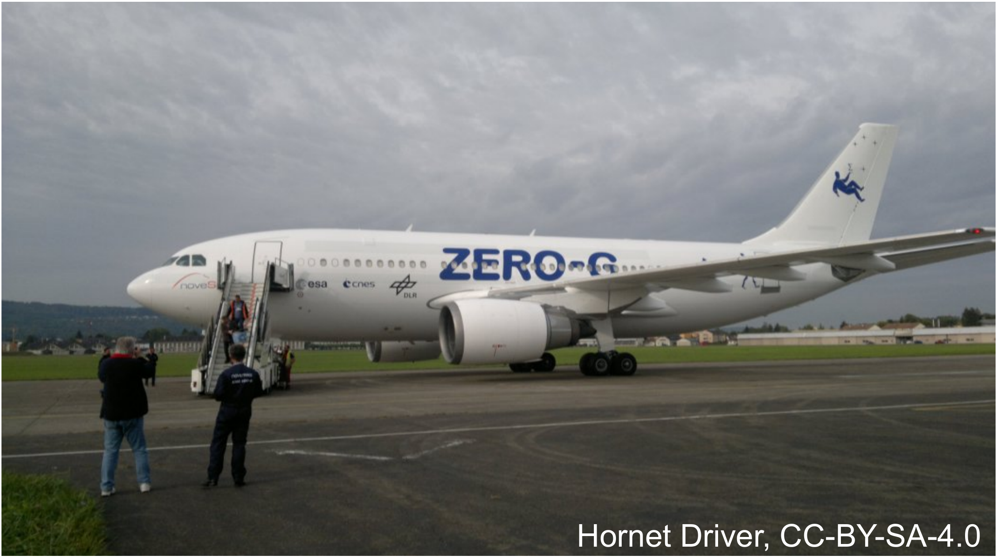
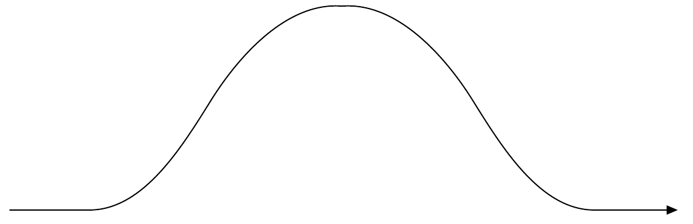

## Problem T1. Zero gravity (10 points)

In all your subsequent calculations, you may use the following physical constants and their numerical values.
The radius of Earth $R_{\oplus}=6.4 \times 10^{6} \mathrm{~m}$.
Free fall acceleration at the sea level $g=9.81 \mathrm{~m} / \mathrm{s}^{2}$.

## Part A. Zero-g flight (3 points)

Astronauts can experience weightlessness during their spaceflight. However, there is a cheaper way to experience weightlessness other than boarding a spaceship: there are airplanes specifically designed to create weigthlessness on board during a certain time period. Such an airplane is shown in the photo.

For this Part, the following values can be also used. The speed of sound at the flying altitude $c_{s}=300 \mathrm{~m} / \mathrm{s}$. The altitude (from the sea level) at which the airplane starts zero-g-flight (the flight segment during which the objects on board the aircraft have zero weight) is $h_{0}=7600 \mathrm{~m}$.
The speed of the airplane when it starts zero-g-flight is $v_{0}=460 \mathrm{~km} / \mathrm{h}$.
The angle between the horizontal plane and the direction of the velocity vector at the moment when the airplane starts zero-g-flight $\alpha_{0}=47^{\circ}$.
i. (0.5 pts) Below is a sketch of a zero-g flight trajectory (the one providing the longest duration of weightlessness might be slightly different). Mark on it the point where zero-g flight starts, and the point where it ends.

ii. (0.5 pts) What should be the direction and magnitude of the acceleration of the airplane to ensure that the passengeres would feel weightlessness?
iii. (0.5 pts) What is the speed of the airplane at the highest point of its trajectory?
iv. (0.5 pts) How long does it take for the airplane to reach the highest point on its trajectory from the moment when it starts zero-g-flight?
v. (0.5 pts) What is the altitude of the airplane at the highest point of its trajectory from the sea level?
vi. (0.5 pts) The possible values of the initial speed $v_{0}$ and initial ascending angle $\alpha_{0}$ are limited by the robustness of the airplane's construction, and by the maximal thrust provided by the engines; the numerical values given above can be considered to be optimal, i.e. yielding the longest period during which the passengers experience weightlessness. Assuming that there are no restrictions on the final diving angle (the angle between the horizontal plane and the direction of the velocity vector at the moment when the airplane ends zero-g-flight) while the only limitation on the speed is that it cannot be larger than the speed of sound, what is the maximal total duration of a zero-g flight segment?

## Part B. Glass of water in weightlessness (3 points)

Consider a partially filled glass of water on board this aircraft. The glass is cylindrical, of radius $r=3 \mathrm{~cm}$; the walls of the glass are negligibly thin. At the moment when the airplane starts zero-g flight, the water surface is flat except for the small meniscus of negligible height near the walls of the glass (see the figure depicting axial crosssection of the glass), and the depth of water is $h_{0}=3 \mathrm{~cm}$. The contact angle of the water in the glass (the angle between the tangent to the water surface and the surface of the glass at the point where the water surface and glass are in direct contact, see the figure) is $\beta=0^{\circ}$ (the figure is illustrative).
i. (1 pt) Under the condition of weightlessness, the water surface will take a new equilibrium shape. Sketch the shape of the water surface at the axial cross-section of the glass.
ii. (1 pt) What is the minimal distance between the water surface and the bottom of the glass at the new equilibrium state?
iii. (1 pt) Under normal conditions, this glass can hold up to $V_{0}=200 \mathrm{ml}$ water. What is the maximal volume of water which can be held in this glass in weightlessness? Sketch also the corresponding shape of the water surface at the axial cross-section of the glass.
Part C. Sharpshooter on geostationary orbit (4 points) Weightlessness can be experienced also on spaceships performing ballistic motion (motion when engines are switched off). Let us consider an astronaut on geostationary orbit. This is a circular orbit around Earth which lies in the equatorial plane, and the period of motion on which is equal to $T_{0}=24 \mathrm{~h}$.
i. (0.7 pts) What is the radius of the geostationary orbit?
ii. (1.8 pts) For research reasons, the astronaut wants to hit his own spaceship with a bullet fired from a rifle equipped onto the spaceship. The speed of the bullet leaving the rifle is $u_{0}=1200 \mathrm{~m} / \mathrm{s}$, the bullet's velocity lies on the orbital plane. Under which angle with respect to the vector pointing towards the centre of the Earth does he needs to aim the rifle if he wants to hit the spaceship within the next 40 hours? You don't need to prove that there is only one suitable shooting angle.
You may use the expression for the total energy of an elliptical orbit, $E_{\text {total }}=-\frac{G M_{\oplus} m}{2 a}$, where $a$ is the semi-major axis.
iii. (1.5 pts) He also tries out another rifle the bullet speed of which can be freely adjusted from zero to the maximal speed $u_{m}=300 \mathrm{~m} / \mathrm{s}$. With this rifle, he aims strictly along the motion of the spaceship. What is the bullet's smallest possible travel time until hitting the spaceship?
