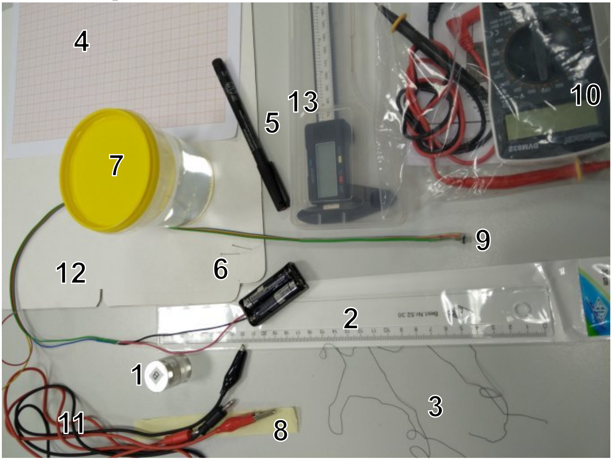
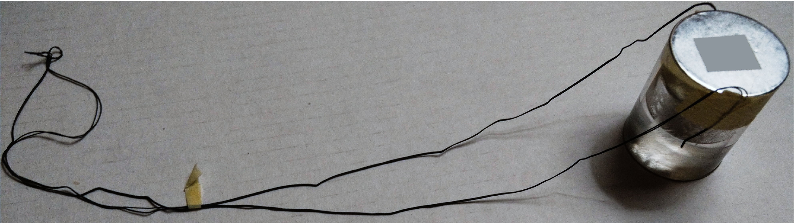
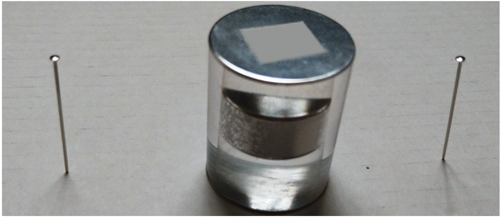
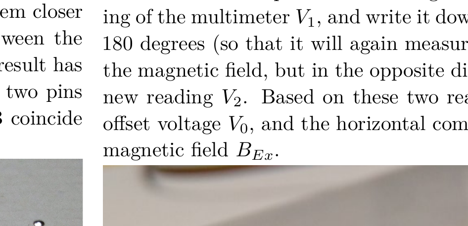

## Problem E1. Cylinder in cylinder (20 points)

The aim of this experiment is to measure various characteristics of the provided transparent cylinder with a permanent magnet inside it.

## Equipment

The following equipment is listed in the figure beneath:
1 - a transparent cylinder with a cylindrical permanent magnet inside and with foil caps covering its top and bottom;
2 - a ruler;
3 - a rubber thread;
4 - graph papers;
5 - a permanent marker;
6 - safety pins;
7 - a cup with water;
8 - a tape, for fixing a rubber thread to the cylinder;
9 - a resistive magnetic field sensor connected to batteries in a battery holder;
10 - a multimeter with wires;
11 - two wires with banana/crocodile connectors;
12 - a piece of cardboard, for fixing the safety pins vertically;
13 - a caliper.

## WARNINGS:

◇ Avoid short-circuiting the battery leads - the battery will overheat and become unusable!
◇ Power off the multimeter when not in use, in order to conserve the batteries.
◇ Do not peel off the foil caps of the transparent cylinder, even if only partially - if you do, your score will be reduced!
◇ Do not move the magnetic sensor too close to the permanent magnet! If you do, the offset voltage $V_{0}$ of the sensor may change ( $V_{0}$ is defined in the problem text.)
◇ Pay attention to the fact that your tables have iron bars beneath. In order to avoid ferromagnetic interference, keep your cylinder and sensor in the middle of the table when doing magnetic measurements.

## Tasks

For all the tasks below, keep in mind that parts of the points are given for the precision of your answer, so design and execute your experiments accordingly. Among other things, this might mean doing additional measurements to improve uncertainty estimates (when the task asks for this).

Always draw a sketch showing your measurement setup with clear indications of the positions of all those measurement tools which you are using for the given task. Describe clearly all steps in your solution, a significant amount of points will be given for the adequate procedure, based on your sketches and descriptions. In all cases, write down all the direct measurements results, the formulas used, and the calculations.
Part A. Geometrical characteristics (5 points)

1. (2 pts) Find the total volume $V$ of the cylinder and estimate the uncertainty of the result.
2. (1 pt) Find the height $h$ of the permanent magnet inside the cylinder and estimate the uncertainty of the result.
3. (2 pts) Design such a method for determining the diameter $d$ of the permanent magnet for which knowing the value of the refraction coefficient of the cylinder is not required. Determine the diameter of the magnet and estimate the uncertainty of the result.
Part B. Mechanical characteristics (3 points)
4. (2 pts) Determine the average density of the cylinder (glass with magnet) knowing that the density of water is $\rho_{w}=1000 \mathrm{~kg} / \mathrm{m}^{3}$.
5. (0.5 pts) Determine the total mass of the cylinder.
6. (0.5 pts) Determine the average density of the glass knowing that the density of the magnet is $\rho_{m}=7500 \mathrm{~kg} / \mathrm{m}^{3}$.

Hint: use the rubber threads as a dynamometer . Join two rubber threads together (to make them stiffer), and, using pieces of tape, attach the ends of the threads to both ends of the cylinder. Also attach a tiny piece of tape to the threads, serving as a marker for taking thread length measurements; the whole setup is shown in the figure below. The tension force in the threads given to you is proportional to the quantity

$$
\tau \equiv\left(1-\lambda^{-1}\right)\left(1-0.2664 \lambda+0.1191 \lambda^{2}\right), \quad \lambda \equiv l / l_{0},
$$

where $l$ denotes the length of the thread, and $l_{0}$ its length in the unstrained state.

Part C. Optical properties (5 points)

1. (2.5 pts) Notice that the transparent part of the cylinder is actually made of two different materials: the coefficient of refraction of the central part $n_{c}$ is slightly different from the coefficient of refraction of the outer part of the cylinder $n_{o}$ (the central part has the same diameter as the permanent magnet). Design a method for determining the coefficient of refraction $n_{o}$ and estimate the uncertainty of the result.

Hint: Measure the apparent diameter of the magnet and relate it to the refractive index $n_{o}$ using Snell's law.
2. (1.5 pts) In order to determine the coefficient of refraction $n_{c}$, you are asked to use the cylinder as a thick lens, and create with it an image of a safety pin, and to use the parallax method for determining the position of the pin's image. To that end, complete the following steps, the end result of which is shown below. Fix two safety pins vertically into the provided piece of cardboard, such that the distance between the pins is bigger than the diameter of the cylinder. Place the cylinder vertically between the two pins such that the distances from both of the pins to the cylinder are strictly equal and such that the pins and the axis of the cylinder lie on the same line $s$. Look at the cylinder from the side of one of the pins, along the line $s$ - so that the pin closer to you (let us call this pin "the pin A") will overlap the image of the other pin - the pin B, as seen through the cylinder. Now, move your head (eye) rightwards; if the pin A moves rightwards from the image of the pin B, it means that it is farther away from you than the image of the pin B. You need to achieve the situation where pin A and the image of pin B coincide: in that case, their relative position will not change when you move your eye leftwards or rightwards from the initial position. You will need to pull the pins out and move them farther away from each other, or move them closer as needed, while maintaining an equal distance between the pins and the cylinder, and repeat it until the desired result has been achieved. Measure the distance $L$ between the two pins on the cardboard once pin A and the image of pin B coincide and estimate the uncertainty of the result.

3. (1 pt) Determine the coefficient of refraction $n_{c}$ of the cylinder.
Hint: you may use the formula

$$
\left(\frac{1}{L-D}-\frac{n_{o}-1}{D}\right)\left(\frac{n_{c} d}{n_{c}-n_{o}}-D\right)=n_{o}
$$

where $D$ denotes the diameter of the cylinder.
Part D. Magnetic properties (7 points)

1. (0.5 pts) Connect the banana ends of the two wires to the COM port and to the V $\Omega \mathrm{mA}$-port of the multimeter. Switch on the multimeter in 20 volt (DC) range, and touch the two metallic leads of the battery holder (which are next to the points were the red and black wires come out from the holder) with the crocodile ends of the wires. Record the voltage $\mathcal{E}$ on the output leads of the battery holder. If the voltage is below 3.0 V, you may ask for replacement batteries.

For all your magnetic field measurements, keep in mind that if the battery voltage were to be exactly 3 V, each millivolt in the reading would correspond to 10 microteslas of the magnetic field strength. However, the reading in millivolts is proportional to both the magnetic field and to the battery voltage. So, to calculate the magnetic field strengths, you will be needing this battery voltage value.

Connect the crocodiles to the yellow and red wires of the magnetic sensor. Keep in mind that the sensor may have a nonzero offset: even if there is no magnetic field, the multimeter reading $V_{0}$ might be non-zero. You should also keep in mind that there is always the magnetic field of Earth.
2. (1 pt) Let the $x$-axis be horizontal and parallel to the shorter edge of your desk. From this part onwards, we measure only the $x$-component of the magnetic fields. It is convenient to fix the magnetic sensor to the plastic box of the caliper with pieces of tape as shown in the figure below: with such a setup the orientation of the sensor can be easily kept unchanged. The arrow in the figure shows the direction of the measured magnetic field component.

Switch on the multimeter in 200 millivolt (DC) range, put the sensor on the table far away from the magnet so that it will measure the $x$-component of the magnetic field, take the reading of the multimeter $V_{1}$, and write it down. Turn the sensor by 180 degrees (so that it will again measure the $x$-comppnent of the magnetic field, but in the opposite direction), and take the new reading $V_{2}$. Based on these two readings, determine the offset voltage $V_{0}$, and the horizontal component of the Earth's magnetic field $B_{E x}$.

3. (2.5 pts) Measure and tabulate the $x$-component of the magnetic field $B_{x}(x)$ of the permanent magnet for a series of points at different distances $x$ from the centre of the magnet, on the symmetry axis of the magnet (the $x$-axis). You are expected to take readings for the full usable range of the distances. Avoid distances by which the voltage reading exceeds 300 mV. Do not forget to report the direct measurement results (the voltages), and when calculating the magnetic field values, to subtract the offset voltage (you need to compensate both for the $x$-component of the Earth's magnetic field, and for the non-zero offset voltage $V_{0}$ ).
4. (2.5 pts) If the distance from the magnet is big enough, its strength is given by the formula

$$
B_{x}(x)=\frac{\mu_{0}}{2 \pi} \frac{p}{x^{3}},
$$

where $p$ denotes the magnetic dipole moment of the magnet and $\mu_{0}=4 \pi \times 10^{-7} \mathrm{H} \mathrm{m}^{-1}$ is the vacuum permeability. Find a way to plot the measurement data from the previous task so that the data points following this formula would lay in a straight line. Show for which values of $x$, the formula holds within the measurement uncertainties. Use your graph to determine the dipole moment of the magnet.
5. (0.5 pts) Find the magnetization $J$ of the permanent magnet (defined as the volume density of the magnetic dipole moment).
