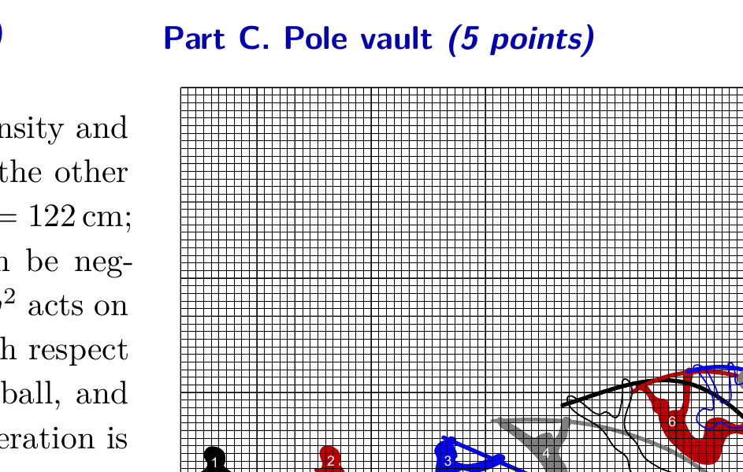
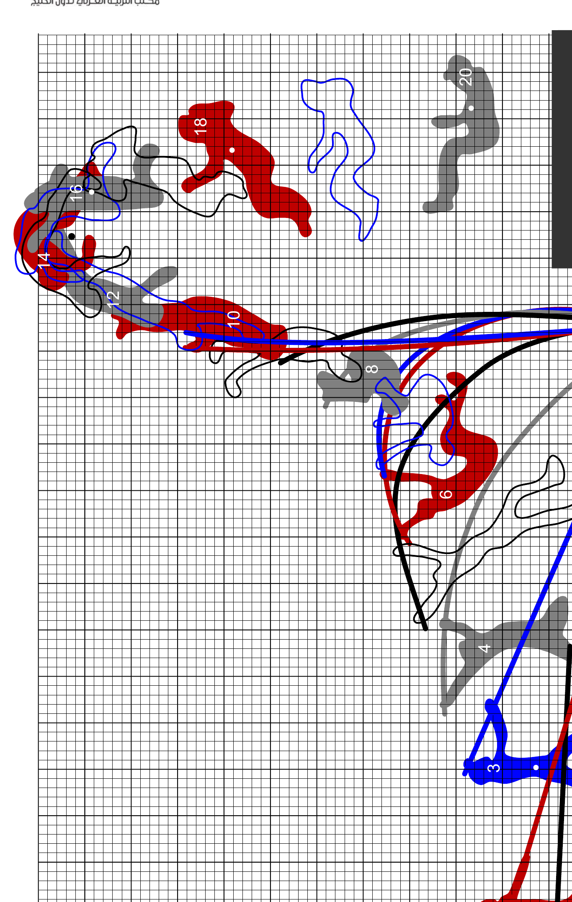

## Problem T3. Physics of sports (10 points)

## Part A. Hammer throw (4 points)

A hammer is an iron ball of mass $m=7.26 \mathrm{~kg}$ density and $\rho_{v}=7900 \mathrm{~kg} / \mathrm{m}^{3}$, fixed to steel wire with a grip on the other end. The length of the steel wire (grip included) is $L=122 \mathrm{~cm}$; the mass and air drag of the wire and the grip can be neglected. During the flight, a drag force $F_{D}=0.24 A \rho_{a} v^{2}$ acts on the hammer, where $v$ is the speed of the hammer with respect to the air, $A$ - the cross-sectional area of the iron ball, and $\rho_{a}=1.23 \mathrm{~kg} / \mathrm{m}^{3}$ - the density of air. Free fall acceleration is $g=9.81 \mathrm{~m} / \mathrm{s}^{2}$.

An athlete throws a hammer to a distance of $d=80 \mathrm{~m}$. Assume that (a) the launching velocity of the hammer forms an angle of 45° with respect to the horizon; (b) immediately before the hammer is released, the hammer moves along a circle of radius $r=L+l$, where $l=1 \mathrm{~m}$ denotes the length of the arms; (c) the height of the hammer above the ground immediately before it is released can be neglected (i.e. taken to be equal to zero).

1. (0.5 pts) What is the speed of the hammer $v_{0}$ just before being released if we neglect the effect of air drag on the hammer?
2. (1 pt) What is the force $F_{t}$ with which the athlete pulls from the grip at the final stage of his throw?
3. (0.5 pts) From this part onwards, we consider the effects of air drag. Find the air drag $F_{D 0}$ acting on the hammer at the beginning of its flight.
4. (1 pt) Estimate as precisely as you can by how much is the final speed of the hammer (just before hitting the ground) smaller than its initial speed.
5. (1 pt) Estimate as precisely as you can by how much would the distance of the throw be longer if there were no air drag. Part B. Discus throw (1 points)

Usually tailwind helps in sports, but not in discus throw. Explain qualitatively, why headwind can increase the distance reached in discus throw. Use a force diagram to show which forces are acting on a discus during its flight and in which way they are influenced by headwind.

Part C. Pole vault (5 points)

The figure shows an athlete (Armand Duplantis) setting the new world record of 618 cm in pole vault (a bigger figure can be found in the next sheet). The figure is to scale and the inter-line distance of the grid is 10 cm. What you can see is an overlay of a series of 20 snapshots, the time interval between two subsequent snapshots $\tau$ is not known. For positions 1, 2, 3, 16, 18, and 20, the white dots show the position of the centre of mass of the athlete. The black dot shows the location of the bar. To avoid clutter, some position numbers are not shown.

1. (0.5 pts) For which position is the elastic energy of the pole the largest?
2. (2 pts) Determine the value of the time interval $\tau$ by taking appropriate readings from the figure. Free fall acceleration is $g=9.81 \mathrm{~m} / \mathrm{s}^{2}$.

Remark: if you are unable to do it, in what follows you may use a very approximate value of $\tau=0.1 \mathrm{~s}$.
3. (0.5 pts) Find the speed of the athlete at the position No 2.
4. (1 pt) During the jump, from the position No 3 to 12, the athlete performs a certain amount of mechanical work $W$ with his muscles. Find this work if the mass of the athlete is $m=80 \mathrm{~kg}$. You may neglect the mass of the pole.
5. (1 pt) What was the maximum height of the centre of mass of the man during the jump? Give the height with respect to the ground (corresponding to the lower boundary of the grid).

