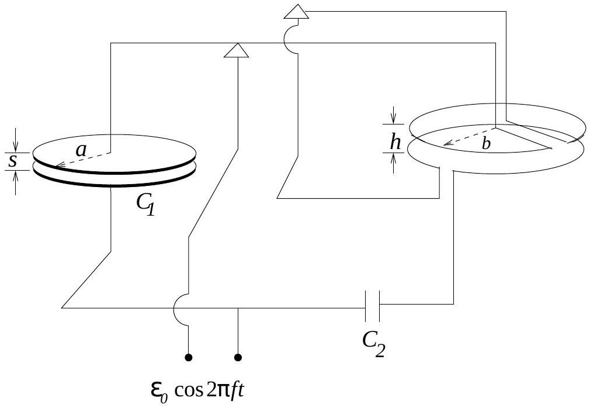

## 6. Determination of The Speed of Light:

The speed light maybe determined by an electrical circuit using low frequency ac fields only. Consider the arrangement shown in the Fig. (4). A sinusoidally varying voltage $V_{0} \cos (2 \pi f t)$ is applied to a parallel plate capacitor $C_{1}$ of radius $a$ and separation $s$ and also to the capacitor $C_{2}$. The charge flowing into and out of $C_{2}$ constitutes the current in the two rings of radii $b$ and separation $h$. When the voltage is turned off the two sides (the capacitor $C_{1}$ on one side and the rings on the other) are exactly balanced. Ignore wire resistance, inductance and gravitational effects.

(a) Obtain an expression for the time-averaged force between the plates of $C_{1}$.
(b) Obtain an expression for the time-averaged force between the rings. The magnetic force between the two rings maybe approximated by those due to long straight wires since $b \gg h$.

Figure 4:

(c) Assume that $C_{2}$ and the various distances are so adjusted that the time-averaged downward force on the upper plate of $C_{1}$ is exactly balanced by the time-averaged downward force on the upper ring. Under these conditions obtain an expression for the speed of light.
(d) Numerically estimate the speed of light given that: $a=0.10 \mathrm{~m}, s=0.005 \mathrm{~m}, b=$ $0.50 \mathrm{~m}, h=0.02 \mathrm{~m}, f=60.0 \mathrm{~Hz}, C_{1}=1.00 \mathrm{nF}$ (nano Farad) and $C_{2}=632 \mu \mathrm{~F}$ (micro Farad).
[Hint: Not all the given quantities are required to obtain the estimate.]
$$
[3+4+2+3=12]
$$
