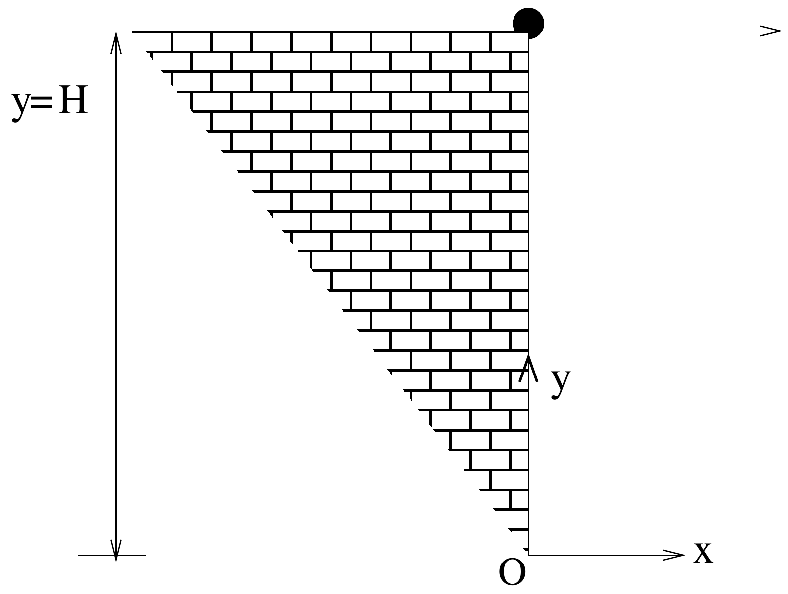

Consider a ball which is projected horizontally with speed $u$ from the edge of a cliff of height $H$ as shown in the Fig. (1). There is air resistance proportional to the velocity in both $x$ and $y$ direction i.e. the motion in the $x(y)$ direction has air resistance given by the $c v_{x}\left(c v_{y}\right)$ where $c$ is the proportionality constant and $v_{x}\left(v_{y}\right)$ is the velocity in the $x(y)$ directions. Take the downward direction to be negative. The acceleration due to gravity is $g$. Take the origin of the system to be at the bottom of the cliff as shown in Fig. (1).

(a) Obtain expression for $x(t)$ and $y(t)$.
(b) Obtain the expression for the equation of trajectory.

(c) Make a qualitative, comparative sketch of the trajectories with and without air resistance.
(d) Given that height of cliff is 500 m and $c=0.05 \mathrm{sec}^{-1}$. Obtain the approximate time in which the ball reaches the ground. Take $g=10 \mathrm{~m}-\mathrm{sec}^{-2}$
