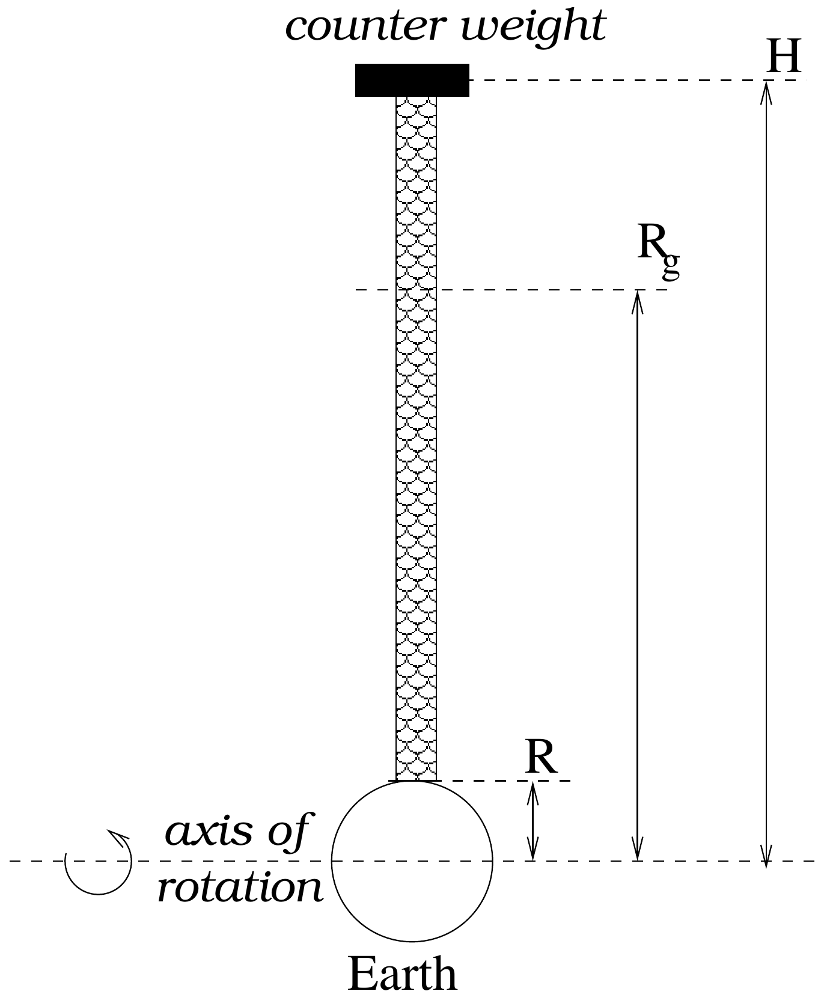

Free Standing Tower

Consider a tower of constant density ( $\rho$ ) and cross sectional area ( $A$ ) (see Fig. (2)) at the earth's equator. The tower has a counter weight at one end. It is free standing. In other words its weight is balanced by the outward centrifugal weight so that it exerts no force on the ground beneath it and tension in the tower is zero at both ends. Consider the earth to be an isolated heavenly body and ignore gravitational effects due to the other heavenly bodies such as moon. Further assume that there is no bending of the tower.

(a) Draw the free body diagram of the small element of this tower at distance $r$ from the center of the earth.
(b) Let $T(r)$ be the tensile stress (tension per unit area) in the tower. Use Newton's equations to write down the equation for $d T / d r$ in terms of $G, \rho$, geostationary height $R_{g}$ from the earth's center and earth's mass $M$.

(c) Taking the boundary condition $\left(T_{R}=T_{H}=0\right)$, obtain the height of tower $H$ in terms of $R$ and $R_{g}$. Note that $R$ is the radius of earth. Calculate the value of $H$.
(d) The tensile stress in the tower changes as we move from $r=R$ to $r=H$. Sketch this tensile stress $T(r)$ ).
(e) Steel has density of $\rho=7.9 \times 10^{3} \mathrm{~kg}-\mathrm{m}^{-3}$. The breaking tensile strength is 6.37 GPa. Calculate the maximum stress in the tower. State if a tower made of steel would be feasible.
Note: $M=5.98 \times 10^{24} \mathrm{~kg} ; R=6370 \mathrm{~km} ; R_{g}=42300 \mathrm{~km}$
