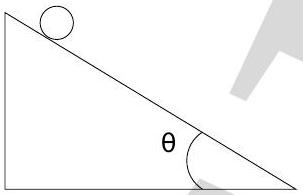

1. Case 1: The object is a sphere and $\mu_{s}=0$ :

    (a) The sphere will roll without slipping for small $\theta$ and slide down only for $\theta$ greater than a certain non-zero value.
    (b) The sphere will remain at rest for small $\theta$ and roll without slipping only for $\theta$ greater than a certain non-zero value.
    (c) The sphere will slide down for all $\theta>0^{0}$.
    (d) The sphere will roll without slipping for all $\theta>0^{0}$.
    (e) None of the above.
