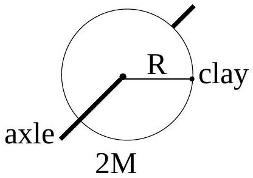
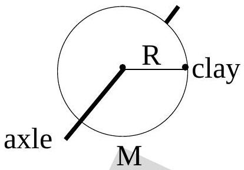

11. Consider the net torque acting on each disk+clay system, about a point on its own axle. Which one of the following statements is true?
    (a) The net torque is greater for the system in which the disk has larger mass.
    (b) The net torque is greater for the system in which the disk has smaller mass.

(c) Which system has a greater net torque depends on the actual numerical values of their masses.
(d) There is no torque on either system.
(e) The net torque on both systems are equal and non-zero.
