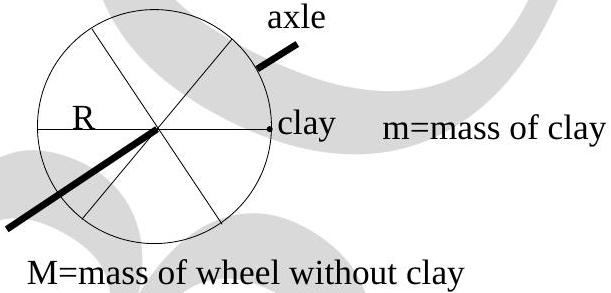

13. A wheel of mass $M$ and radius $R$ is free to rotate about a fixed horizontal axle. A small lump of clay of mass $m$ is attached to its rim as shown in the figure. Consider the magnitude of the net torque $\tau$ acting on the wheel+clay system about a point on the axle shown in the figure given below, and let $g$ be the magnitude of the acceleration due to gravity. Which one of the following statements is true?

(a) $\tau=m g R$
(b) $\tau=(m+M) g R$
(c) $\tau=(m+M / 2) g R$
(d) $\tau=(m+M) g / R$
(e) None of the above.
