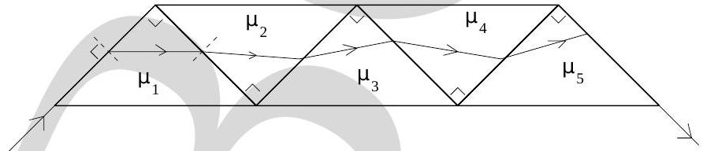

13. A ray of light enters at grazing angle of incidence into an assembly of five isosceles right-angled prisms having refractive indices $\mu_{1}, \mu_{2}, \mu_{3}, \mu_{4}$ and $\mu_{5}$ respectively (see Fig. (5)). The ray also

Figure 5:

emerges out at a grazing angle. Then

    (a) $\mu_{1}^{2}+\mu_{3}^{2}+\mu_{5}^{2}=1+\mu_{2}^{2}+\mu_{4}^{2}$
    (b) $\mu_{1}^{2}+\mu_{3}^{2}+\mu_{5}^{2}=2+\mu_{2}^{2}+\mu_{4}^{2}$
    (c) $\mu_{1}^{2}+\mu_{3}^{2}+\mu_{5}^{2}=\mu_{2}^{2}+\mu_{4}^{2}$
    (d) none of the above
