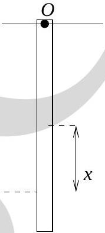

15. Consider an infinitely extending gas cloud in space at temperature $T=0 \mathrm{~K}$ with two spherical vacuum cavities (see Fig. (7)). Consider only gravitational forces between gas molecules. Then
    (a) the cavities would come closer to each other.
    (b) the cavities would move away from each other.
    (c) the cavities would be static.
    (d) the motion of cavities would depend on the size of cavities.
Questions (16) and (17) are based on Fig. (8) and following information. A rod of mass $m$ and

length $l$ is hinged at one end $O$. A particle of mass $m$ travelling with speed $v$ collides with the rod at a distance $x$ from the center of mass of the rod such that the reaction force at the hinge is zero.
