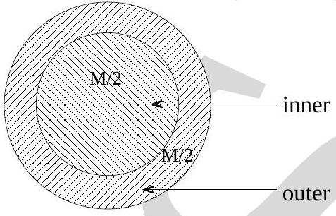

18. Consider the moment of inertia, $I$, of the rigid homogeneous disk of mass $M$ shown below, about an axis through its center (different shadings only differentiate the two parts of the disk, each with equal mass $M / 2$ ). Which one of the following statements concerning $I$ is correct?

    (a) The inner and outer parts of the disk, each with mass $M / 2$ (see figure), contribute equal amounts to $I$.
    (b) The inner part of the disk contributes more to $I$ than the outer part.
    (c) The inner part of the disk contributes less to $I$ than the outer part.
    (d) The inner part of the disk may contribute more or less to $I$ than the outer part depending on the actual numerical value of the mass $M$ of the disk.
    (e) None of the above.
