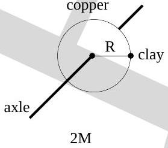
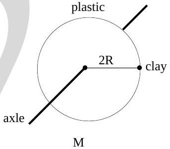

19. A copper disc and a plastic disc have different radii and masses as shown below. Each disk is free to rotate about its own fixed horizontal frictionless axle. Both disks are initially at rest. Identical small lumps of clay are attached to their rims as shown in the figure. Consider the net torque acting on each disc+clay system, about a point on its own axle. Which one of the following statements is true?

    (a) The net torque is greater for the system with the plastic disk.
    (b) The net torque is greater for the system with the copper disk.
    (c) Which system has a greater net torque depends on the actual numerical values of the masses and the radii of the disks.
    (d) There is no net torque on either system.
    (e) The net torques on both systems are equal and non-zero.
