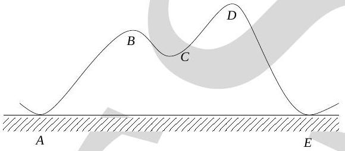

19. A particle of mass 1 kg is taken along the path $A B C D E$ from $A$ to $E$ (see Fig. (9)). The two "hills" are of heights 50 m and 100 m and the horizontal distance $A E$ is 20 m while the path length is 400 m. The coefficient of friction of the surface is 0.1 . Take $g=10 \mathrm{~m}-\mathrm{s}^{-2}$ and $\sqrt{3}=1.73$. The minimum work on the mass required to accomplish this is

Figure 9:

    (a) 20 J
    (b) 173 J
    (c) 400 J
    (d) 0 J
