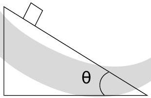

2. Case 2: The object is a cube and $\mu_{s}=0$. In this experiment, the angle $\theta$ is varied only between $0^{0}$ and $45^{0}$ :

    (a) The cube will slide down for all $45^{0}>\theta>0^{0}$.
    (b) The cube will remain at rest for small $\theta$ and slide down only for $\theta$ greater than a certain non-zero value.
    (c) The cube will roll without slipping for all $45^{0}>\theta>0^{0}$.
    (d) The cube will tumble down for all $45^{0}>\theta>0^{0}$.
    (e) None of the above.
