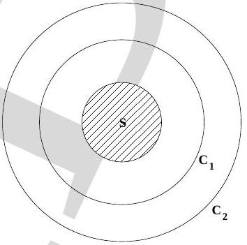

2. A spatially uniform magnetic field $\vec{B}$ exists in the circular region $S$ and this field is decreasing in magnitude with time at a constant rate (see Fig. (1)). The wooden ring $C_{1}$ and the conducting

Figure 1:

ring $C_{2}$ are concentric with the magnetic field. The magnetic field is perpendicular to the plane of the figure. Then

    (a) there is no induced electric field in $C_{1}$.
    (b) there is an induced electric field in $C_{1}$ and its magnitude is greater than the magnitude of the induced electric field in $C_{2}$.
    (c) there is an induced electric field in $C_{2}$ and its magnitude is greater than the induced electric field in $C_{1}$.
    (d) there is no induced electric field in $C_{2}$.
