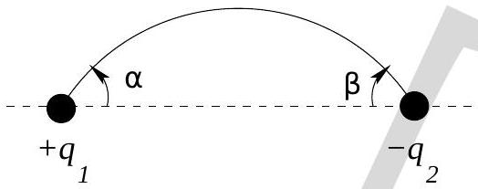

21. An electrostatic field line leaves at angle $\alpha$ from point charge $q_{1}$, and connects with point charge $-q_{2}$ at angle $\beta$ (see Fig. (11)). Then the relationship between $\alpha$ and $\beta$ is

Figure 11:

    (a) $q_{1} \sin ^{2} \alpha=q_{2} \sin ^{2} \beta$.
    (b) $q_{1} \tan \alpha=q_{2} \tan \beta$.
    (c) $q_{1} \sin ^{2} \frac{\alpha}{2}=q_{2} \sin ^{2} \frac{\beta}{2}$.
    (d) $q_{1} \cos \alpha=q_{2} \cos \beta$.
