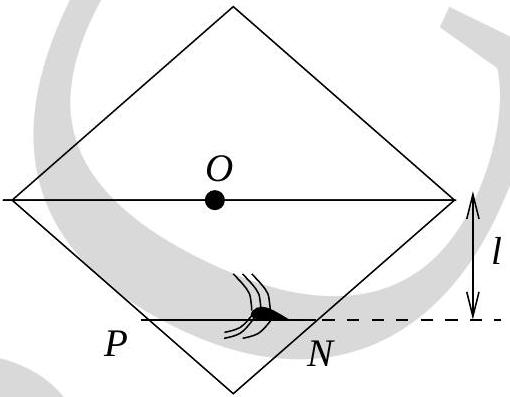

22. A square metal frame in the vertical plane is hinged at $O$ at its center (see Fig. (12)). A bug moves along the rod $P N$ which is at a distance $l$ from the hinge, such that the whole frame is always stationary, even though the frame is free to rotate in the vertical plane about the hinge. Then the motion of the bug will be simple harmonic, with time period,

Figure 12:

    (a) $2 \pi \sqrt{l / g}$
    (b) $2 \pi \sqrt{2 l / g}$
    (c) $2 \pi \sqrt{4 l / g}$
    (d) $2 \pi \sqrt{l / 2 g}$

[ Hint: There is a frictional force between the rod and the bug. ]
