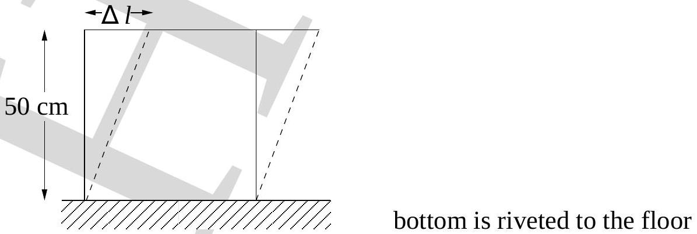

28. The shear modulus of lead is $2 \times 10^{9} \mathrm{~Pa}$. A cubic lead slab of side 50 cm is subjected to a shearing force of magnitude $9.0 \times 10^{4} \mathrm{~N}$ on its narrow face (see Fig. (14)). The displacement of

Figure 14:

the upper edge is $\delta l$, where $\delta l$ is

(a) $2 \times 10^{-3} \mathrm{~m}$
(b) $5 \times 10^{-4} \mathrm{~m}$
(c) $4 \times 10^{-4} \mathrm{~m}$
(d) $9 \times 10^{-5} \mathrm{~m}$
