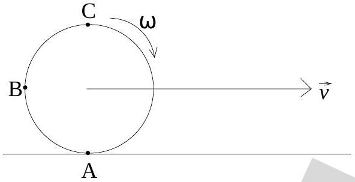

3. Case 3: The object is a cube and $\mu_{s}$ is very large ( $\mu_{s} \gg 1$ ):
    (a) The cube will remain at rest for small $\theta$ and slide down only for $\theta$ greater than a certain non-zero value.
    (b) The cube will stay on the incline as if it were glued to it, for all $\theta$.
    (c) The cube will move relative to the inclined plane only for $\theta=90^{0}$.
    (d) The cube will tumble down only for $\theta>45^{0}$.
    (e) None of the above.

Setup for next two questions
A rigid wheel of radius $R$ rolls without slipping on a horizontal road. The linear velocity of the center of the wheel with respect to the road is $\vec{v}$ and the angular speed is $\omega$.

