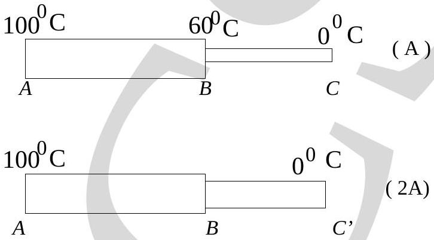

30. Which of the following statement is TRUE ?
(a) Sound waves cannot interfere.
(b) Only light waves may interfere.
(c) The de Broglie waves associated with moving particles can interfere.
(d) The Bragg formula for crystal structure is an example of the corpuscular nature of electromagnetic radiation.

Figure 15:
