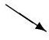
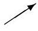
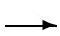
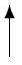

4. The direction of instantaneous velocity of point B (see the figure above) with respect to the road is roughly:
    (a) 
    (b) 
    (c) 
    (d) 
    (e) There is no direction since the instantaneous speed of point B is zero with respect to the road.
