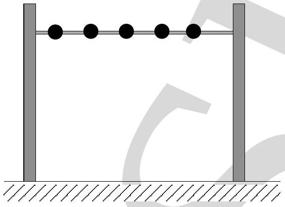

4. Five identical balls each of mass $m$ and radius $r$ are strung like beads at random and at rest along a smooth, rigid horizontal thin rod of length $L$, mounted between immovable supports (see Fig. (2)). Assume $10 r<L$ and that the collision between balls or between balls and supports

Figure 2:

are elastic. If one ball is struck horizontally so as to acquire a speed $v$, the average force felt by the support is

    (a) $\frac{5 m v^{2}}{L-5 r}$
    (b) $\frac{m v^{2}}{L-10 r}$
    (c) $\frac{5 m v^{2}}{L-10 r}$
    (d) $\frac{m v^{2}}{L-5 r}$
