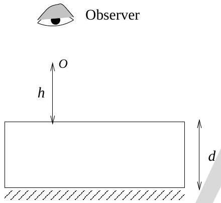

6. A point luminous object $(O)$ is at a distance $h$ from front face of a glass slab of width $d$ and of refractive index $n$. On the back face of slab is a reflecting plane mirror. An observer sees the image of object in mirror (see Fig. (3)). Distance of image from front face as seen by observer will be
    (a) $h+\frac{2 d}{n}$
    (b) $2 h+2 d$

Figure 3:

(c) $h+d$
(d) $h+\frac{d}{n}$
