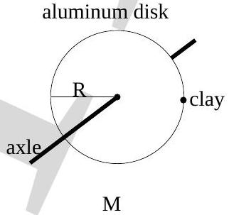
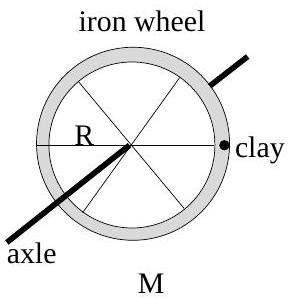

Setup for next two questions
An aluminum disk and an iron wheel (with spokes of negligible mass) have the same radius $R$ and mass $M$ as shown below. Each is free to rotate about its own fixed horizontal frictionless axle. Both objects are initially at rest. Identical small lumps of clay are attached to their rims as shown in the figure.

7. Consider the net torque acting on the disc+clay and wheel+clay systems, about a point on its own axle. Which one of the following statements is true?
    (a) The net torque is greater for the disc+clay system.
    (b) The net torque is greater for the wheel+clay system.
    (c) Which system has a greater net torque depends on actual numerical values of $R$ and $M$.
    (d) There is no net torque on either system.
    (e) The net torque on both systems are equal and non-zero.

8. Which one of the following statements about their angular acceleration is true?
    (a) The angular acceleration is greater for the disk+clay system.
    (b) The angular acceleration is greater for the wheel+clay system.
    (c) Which system has greater angular acceleration depends in the actual numerical values of $R$ and $M$.
    (d) There is no angular acceleration for either system.
    (e) The angular acceleration of both the systems are equal and non-zero.

9. Which one of the following statements about their maximum angular velocities is true?
    (a) The maximum angular velocity is greater for the disk+clay system.
    (b) The maximum angular velocity is greater for the wheel+clay system.
    (c) Which object has a greater maximum angular velocity is determined by the actual numerical values of $R$ and $M$.
    (d) The maximum angular velocities of both systems are equal and non-zero.
    (e) There is no angular velocity for either system so the question of a maximum value does not arise.
