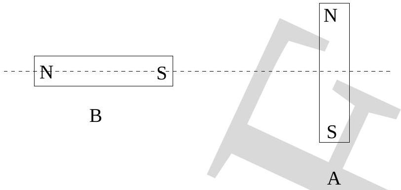

13. Two strong bar magnets A and B are placed on a horizontal table such that the axis of B intersects A at mid-point as shown in figure. B is fixed while A is free to move. There are no magnetic fields except those due to A and B. Then A will

    (a) rotate but not move toward or away from B.
    (b) rotate and move toward B.
    (c) move toward B and not rotate.
    (d) rotate and move away from B.
    (e) move away from B and not rotate.
