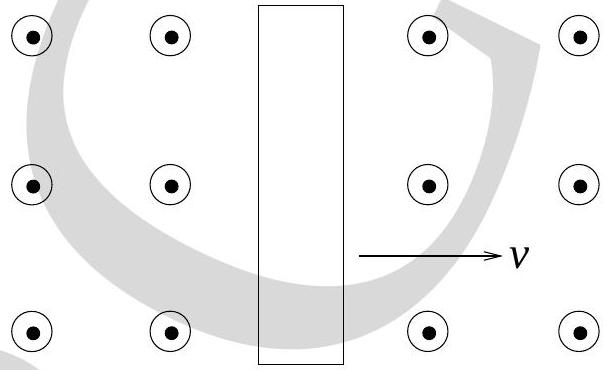
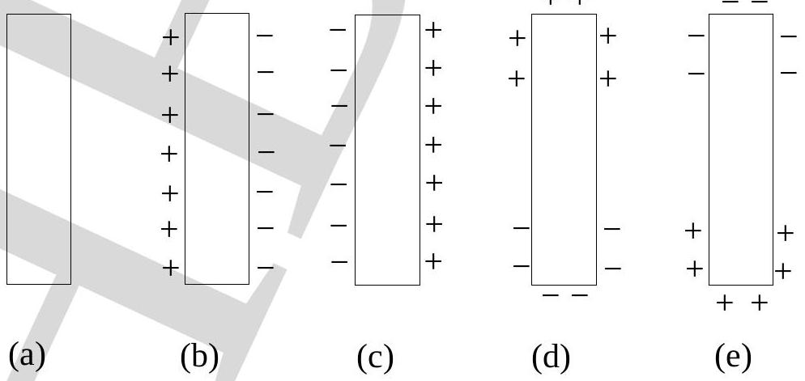

14. A neutral metal bar is moving at constant velocity $v$ to the right through a region where there is a uniform magnetic field pointing out of the page. The magnetic field is produced by some large coils which are not shown in the diagram.

Which one of the following diagrams best describes the charge distribution on the metal bar?

