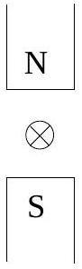

15. A wire is placed between the poles of two fixed bar magnets as shown. A small current in the wire is into the plane of the paper. The direction of the magnetic force on the wire is

(a) ↑
(b) ↓
(c) →
(d) ←
(e) ⊙ out of the plane of the paper.
