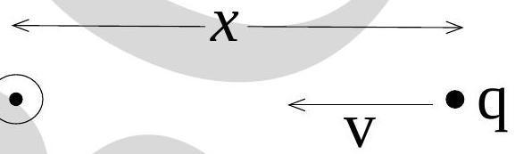

17. The figure below depicts a long wire carrying a current coming out of the plane of the paper. A charge $q$ at a distance $x$ from it is moving towards it with speed $v$ and experiences a magnetic force of magnitude $F$. If the distance of the charge from the wire were $2 x$ (and all other conditions remaining the same) then the force would be

(a) $F$
(b) $2 F$
(c) $F / 2$
(d) $F / 4$
(e) zero.
