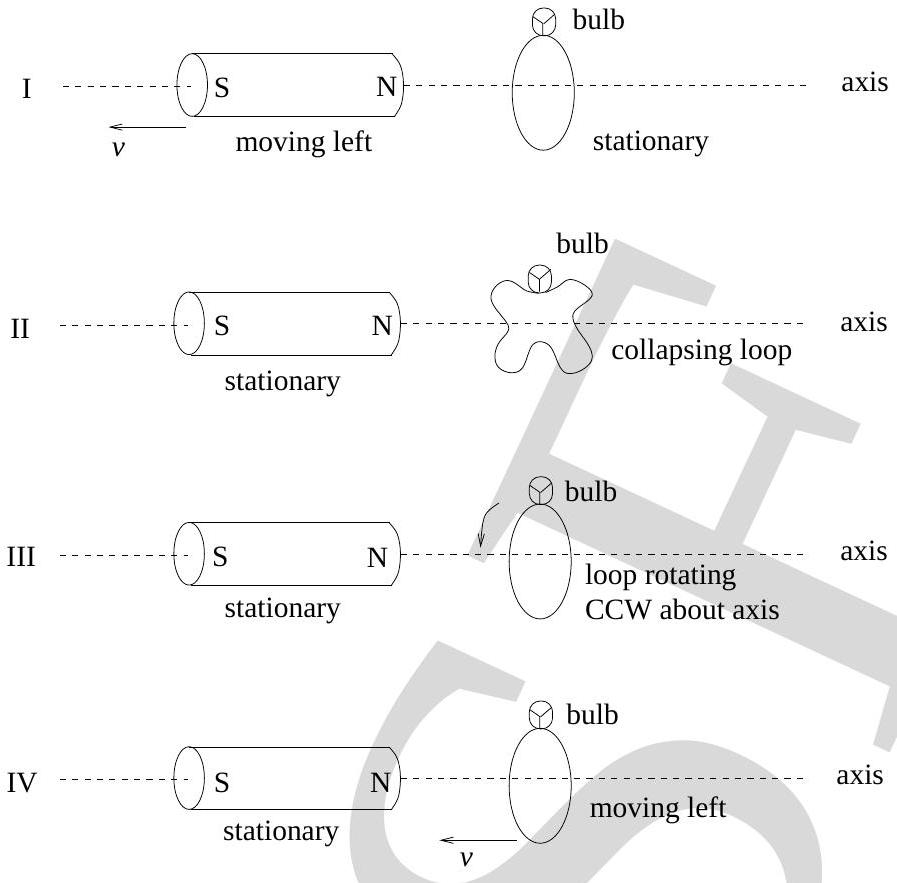

18. The four separate figures below involve a cylindrical magnet and a tiny light bulb connected to the ends of a loop of copper wire. These figures are to be used in the following question. The plane of the wire loop is perpendicular to the reference axis. The states of motion of the magnet and of the loop of wire are indicated in the diagram. Speed will be represented by $v$ and CCW represents counter clockwise.

In which one of the above figures will the light bulb be glowing?
(a) I, II, III
(b) II, III, IV
(c) I, III, IV
(d) I, II, IV
(e) I, II, III, IV
