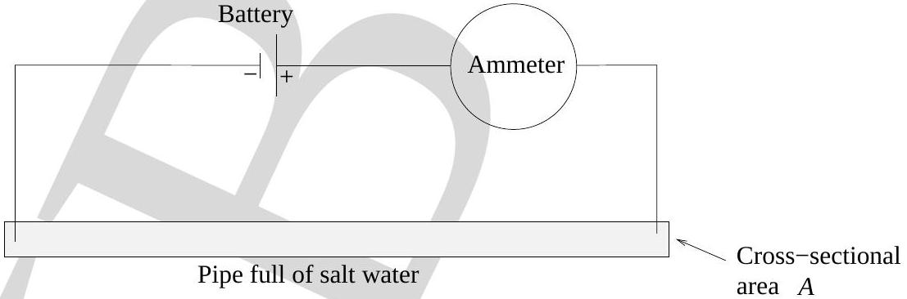

9. Salt water contains $n$ sodium ions $\left(\mathrm{Na}^{+}\right)$per cubic meter and n chloride ions $\left(\mathrm{Cl}^{-}\right)$ per cubic meter. A battery is connected to metal rods that dip into a narrow pipe full of salt water. The cross sectional area of the pipe is $A$. The magnitude of the drift velocity of the sodium ions is $V_{N a}$ and the magnitude of the drift velocity of the chloride ions is $V_{C l}$. Assume that $V_{N a}>V_{C l}$ ( $+e$ is the charge of a proton).

What is the magnitude of the ammeter reading?
(a) $e n A V_{N a}-e n A V_{C l}$
(b) $e n A V_{N a}+e n A V_{C l}$
(c) $e n A V_{N a}$
(d) $e n A V_{C l}$
(e) zero
