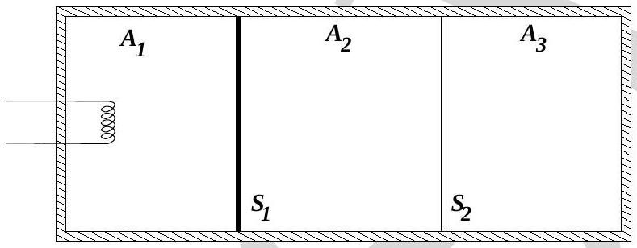

2. Consider a closed cylinder whose walls are adiabatic. The cylinder lies in a horizontal position and is divided into three parts $A_{1}, A_{2}$ and $A_{3}$ by means of partitions $S_{1}$ and $S_{2}$ which can move along the length of the cylinder without friction. Piston $S_{1}$ is adiabatic while $S_{2}$ is conducting. Initially each of the parts $A_{1}, A_{2}$ and $A_{3}$ contains one mole of Helium gas at pressure $P_{0}$, temperature $T_{0}$, and volume $V_{0}$ (see Fig. (2)). Helium is to be regarded as an ideal monoatomic gas. Also $C_{v}=3 R / 2, C_{p}=5 R / 2$ and $\gamma=5 / 3$.
Now heat is slowly supplied to the gas in part $A_{1}$ till the temperature in part $A_{3}$ becomes $T_{3}=9 T_{0} / 4$.

$$
[3.5+2+2+2.5=10]
$$

Figure 2:

    (a)Let the final thermodynamic coordinates of the partitions $A_{1}, A_{2}$ and $A_{3}$ be $\left\{P_{1}, V_{1}, T_{1}\right\},\left\{P_{2}, V_{2}, T_{2}\right\}$ and $\left\{P_{3}, V_{3}, T_{3}\right\}$ respectively. Fill the table below expressing the pressure in terms of $P_{0}$, volume in terms of $V_{0}$ and temperature in terms of $T_{0}$ :

| $P_{1}=$ | $P_{2}=$ | $P_{3}=$ |
| :--- | :--- | :--- |
| $V_{1}=$ | $V_{2}=$ | $V_{3}=$ |
| $T_{1}=$ | $T_{2}=$ | $T_{3}=$ |
    (b) What work is done by the gas in $A_{1}$ on the gases in $A_{2}$ and $A_{3}$ in terms of $\left\{P_{0}, V_{0}\right\}$ and related quantities?
Work done =
    (c) What is the amount of heat supplied to the gas in part $A_{1}$ in terms of $\left\{P_{0}, V_{0}\right\}$ and related quantities?

Heat supplied =

(d) Obtain the entropy change in systems $A_{2}+A_{3}$ and $A_{1}$ ?
Entropy Change in $A_{2}+A_{3}=$
Entropy change in $A_{1}=$
