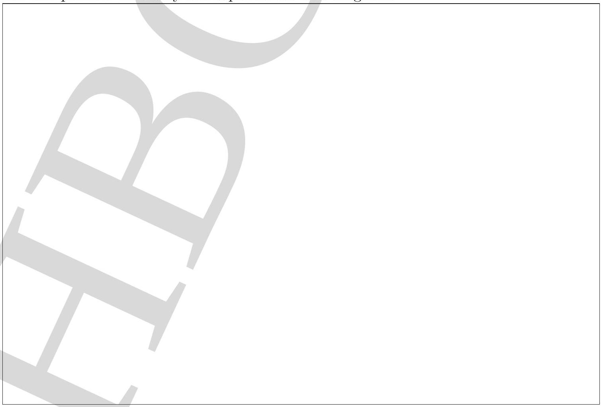

3. A small angle prism of crown glass and a small angle prism of flint glass are arranged to deviate a light beam in opposite directions. A white light beam is incident on the crown glass prism of the arrangement. The refracting angle of the crown prism is $10.0^{0}$ and that of the flint prism is such that the net deviation of the light beam from both the prisms for the $C$ and $F$ spectral lines are equal. Assume minimum deviation condition for both the prisms. See Table 1 below.

Table 1: Values of $n$ (refractive indices) for three different spectral lines.
|  | $C$ | $D$ | $F$ |
| :--- | :--- | :--- | :--- |
| Flint | 1.644 | 1.650 | 1.665 |
| Crown | 1.517 | 1.520 | 1.527 |

$$
[3+2+5=10]
$$

(a) State the refracting angle $\left(A_{F}\right)$ of the flint prism in degrees.
$$
A_{F}=
$$
(b) State the net deviation $\left(\Delta_{D}\right)$ for the $D$ line in degrees.
$$
\Delta_{D}=
$$
(c) Draw a schematic ray diagram of the $D$ line for this arrangement indicating the numerical values of the following important angles: (i) incidence on each prism; (ii) deviation from each prism and (iii) angle between the adjacent surfaces of the two prisms. You may use a pencil for this diagram.

