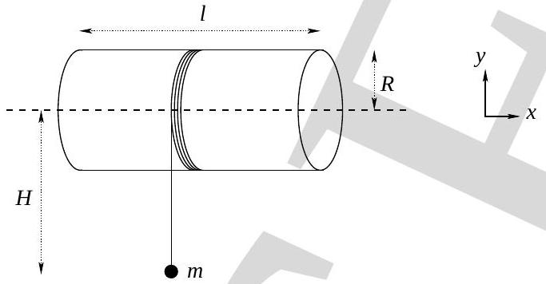

4. Consider a long thin uniform electrically insulating and magnetically nonpermeable cylindrical shell of length $l$, radius $R$ (with $l \gg R$ ) and moment of inertia $I$ about the horizontal axis (see Fig. 3). A massless string is wound around the shell surface and a vertically hanging mass $m$ is attached to its free end and released from rest at time $t=0$.

$$
[1+1+1+2+2+1+2+1.5+2+1.5=15]
$$

Figure 3:

    (a) State the magnitude of angular acceleration $\alpha$ in terms of $\{m, g, R$, and $I\}$.
$$
\alpha=
$$
    (b) State the magnitude of angular velocity $(\omega)$ of the shell in terms of $\{\alpha, H$ and $R\}$. Here $H$ is the height through which mass ' $m$ ' has fallen.
$$
\omega=
$$
    (c) State the total kinetic energy $(K)$ of the assembly in terms of $m, g$ and $H$.
$$
K=
$$

Let a charge $Q$ be uniformly distributed on the shell. As the shell rotates it will produce a magnetic field $(\vec{B})$ and an electric field of magnitude $E$ associated with electromotive force in accordance with Faraday's law of induction. Let $\alpha^{\prime}$ and $\omega^{\prime}$ denote the magnitudes of angular acceleration and angular velocity of this rotating charged shell respectively. Ignore radiation losses due to acceleration.

(d) State magnetic field in terms of $Q, \omega^{\prime}$ and relevant quantities.
$$
\vec{B}=
$$

(e) State $E$ in terms of $\alpha^{\prime}$ and relevant quantities.
$$
E=
$$
(f) Electric field produces a torque $\left(\vec{\tau}_{e m}\right)$ on this shell. State $\tau_{e m}$ in terms of $E$ and relevant quantities.
$$
\tau_{e m}=
$$
(g) State $\alpha^{\prime}$.
$$
\alpha^{\prime}=
$$
(h) State total kinetic energy $\left(K^{\prime}\right)$ of the shell in terms of $m, g, H$ and relevant quantities.
$$
K^{\prime}=
$$
(i) State the difference in energies obtained in parts (4c) and (4h) in terms of $B$, $R, l$ and relevant quantities.
$$
K^{\prime}-K=
$$
(j) Interpret $K^{\prime}-K$.
