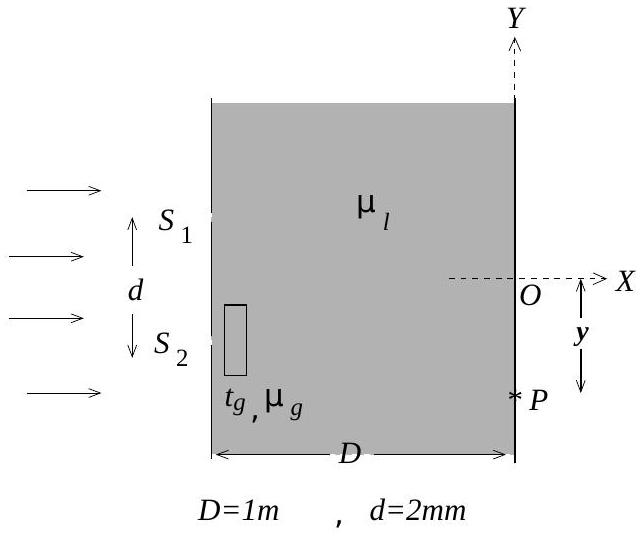

2. In a modified Young's double slit experiment the region between screen and slits is immersed in a liquid whose refractive index varies with time $t$ (in seconds) as $\mu_{l}=$ $2.50-0.25 t$ until it reaches a steady state value 1.25. The distance between the slits and the screen is $D=1.00 \mathrm{~m}$ and the distance between the slits $S_{1}$ and $S_{2}$ is $d=2.00 \times 10^{-3} \mathrm{~m}$. A glass plate of thickness $t_{g}=3.60 \times 10^{-5} \mathrm{~m}$ and refractive index $\mu_{g}=1.50$ is introduced in front of one of the slits. Note that the illuminations at $S_{1}$ and $S_{2}$ are from coherent sources with zero phase difference.
$$
[2.5+2.5+1+2+2=10]
$$

(a) Consider the point $P$ on the screen at distance $y$ from $O\left(S_{1} O=S_{2} O ; O P=y\right)$. Obtain the expression for the optical path difference $\Delta x$ in terms of the refractive indices and the lengths mentioned in the problem.

$\Delta x=$
(b) Now let $P$ denote the central maximum. Obtain the expression for $y$ as a function of time.
$y=$
(c) Obtain the time $\left(t_{m}\right)$ when central maximum is at point $O$, equidistant from $S_{1}$ and $S_{2}$ i. e. $S_{1} O=S_{2} O$.

$t_{m}=$
(d) What is the speed $(v)$ of the central maxima when it is at $O$.

$$
v=
$$

(e) If monochromatic light of wavelength $6000 \AA$ is used to illuminate the slits, determine the time interval ( $\Delta t$ ) between two consecutive maxima at $O$ before steady state is reached.

$\Delta t=$
