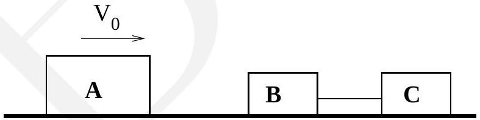

6. Two blocks, say $B$ and $C$, each of mass $m$ are connected by a light spring of force constant $k$ and natural length $L$. The whole system is resting on a frictionless table such that $x_{B}=0$ and $x_{C}=L$, where $x_{B}$ and $x_{C}$ are the coordinates of the blocks $B$ and $C$ respectively. Another block (named $A$ ) of mass $M$, which is travelling at speed $V_{0}$ collides head-on with the block $B$ at an instant $t=0$ (see Fig. (3)).

$$
[3+2+2+3=10]
$$

Figure 3:

    (a) Obtain the velocities of blocks $A, B$ and $C$ just after the collision at $t=0$ ? Express the velocities in terms of $V_{0}$ and $\gamma=m / M$. Assume that the collision is elastic.

$V_{A}=$
$V_{B}=$
$V_{C}=$
(b) Draw free body diagrams for the blocks $B$ and $C$ after the collison and write down the equation of motion.
Free body diagram:
Equation of motion:
(c) For $t>0$ the positions of the blocks are given by
$$
\begin{array}{r}
x_{B}=\alpha t+\beta \sin (\omega t) \\
x_{C}=L+\alpha t-\beta \sin (\omega t)
\end{array}
$$
Find $\omega$ in terms of $m$ and $k$. Express $\alpha$ and $\beta$ in terms of $V_{0}, \gamma$ and $\omega$. (For this part, ignore the motion of block A.)

$\omega=$
$\alpha=$
$\beta=$
(d) Obtain the condition on $\gamma$ such that the block $A$ will collide with the block $B$ again at some time $t>0$ ?

Condition on $\gamma$ :
