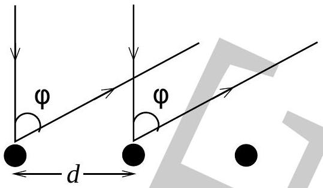

2. The figure below depicts the reflection of normally incident monochromatic wave by two neighbouring surface atoms of crystal. Angle of reflection and nearest neighbour distance are $\phi$ and $d$ respectively. [Marks: 5]

Two reflected waves will interfere. The interference is due to deBroglie wave of the electron accelerated from rest by less then 1 keV.
    (a) Obtain a relationship between $\phi, d$ and the kinetic energy $(K)$ of the electron with rest mass $m_{0}$ for the case of constructive interference. [3]
    (b) Calculate $d$ if first maxima occurs at $\phi=30$ deg for $K=100$ eV electron.

