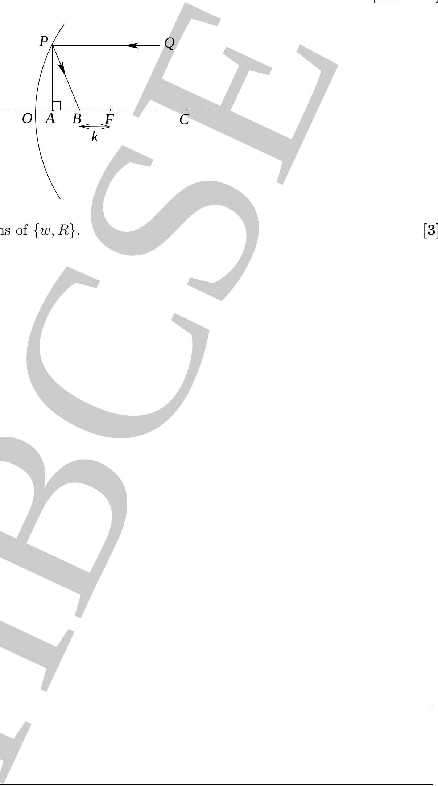
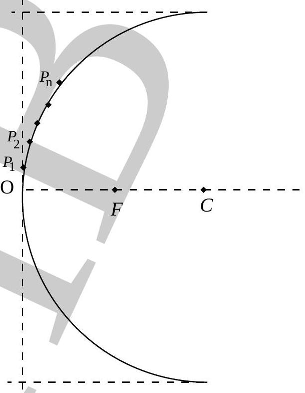

4. The figure below depicts a concave mirror with center of curvature $C$ focus $F$, and a horizontally drawn $O F C$ as the optic axis. The radius of curvature is $R(O C=R)$ and $O F=R / 2$ ). A ray of light $Q P$, parallel to the optical axis and at a perpendicular distance $w(w \leq R / 2)$ from it, is incident on the mirror at $P$. It is reflected to the point $B$ on the optical axis, such that $B F=k$. Here $k$ is a measure of lateral aberration. [Marks: 8]

(b) Sketch $k$ vs $w$ for $w \in[0, R / 2]$.
(c) Consider points $P_{1}, P_{2}, \ldots . P_{n}$ on the concave mirror which are increasingly further
(c) Consider points $P_{1}, P_{2}, \ldots . P_{n}$ on the concave mirror which are increasingly further away from the optic center $O$ and approximately equidistant from each other(see away from the optic center $O$ and approximately equidistant from each other(see figure below). Rays parallel to the optic axis are incident at $P_{1}, P_{2}, \ldots . P_{n}$ and figure below). Rays parallel to the optic axis are incident at $P_{1}, P_{2}, \ldots . P_{n}$ and reflected to points on the optic axis. Consider the points where these rays re- reflected to points on the optic axis. Consider the points where these rays reflected from $P_{n}, P_{n-1}, \ldots . . P_{2}$ intersect the rays reflected from $P_{n-1}, P_{n-2}, \ldots . P_{1}$ flected from $P_{n}, P_{n-1}, \ldots . . P_{2}$ intersect the rays reflected from $P_{n-1}, P_{n-2}, \ldots . P_{1}$ respectively. Qualitatively sketch the locus of these points in figure below for a respectively. Qualitatively sketch the locus of these points in figure below for a mirror (shown with solid line) with radius of curvature 2 cm. mirror (shown with solid line) with radius of curvature 2 cm.
$+1 \mathrm{~cm}$

