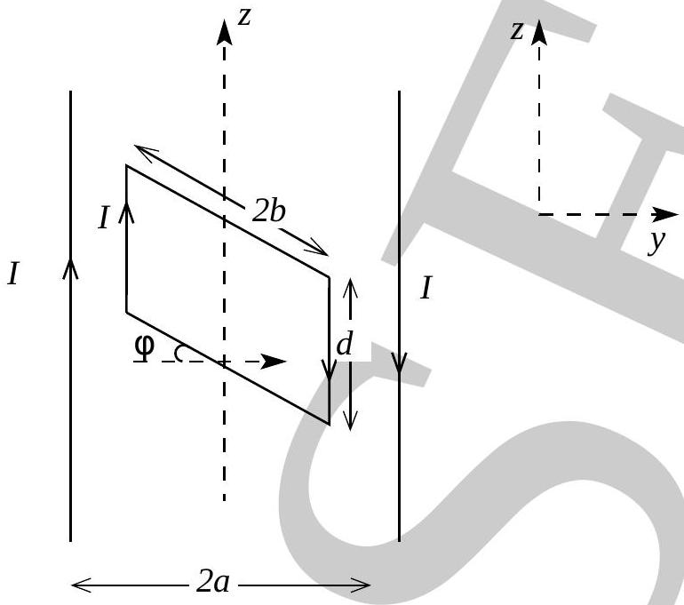
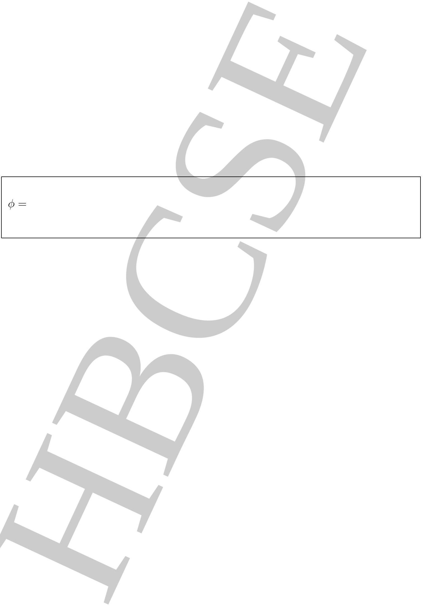

5. Two long parallel wires in the $y z$ plane at a distance $2 a$ apart carry a steady current $I$ in opposite directions. Midway between the wires is a rectangular loop of wire $2 b \times d$ carrying current $I$ as shown in the figure $(b<a<2 b)$. The loop is free to rotate about the $z$ axis and the currents remain fixed to $I$ irrespective of the relative motion between the loop and the wire.
[Marks: 8]

    (a) Obtain the torque tending to rotate the rectangular loop about its axis as a function of $\phi$. Here $\phi$ is the angle that plane of loop makes with the plane of wires.

Torque is

(b) Obtain the value of $\phi$ for which the torque is maximum? [3]

