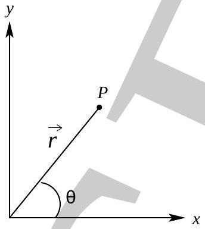

6. A planet of mass $m$ is orbiting a star of mass $M(M \gg m)$ under the influence of a central force. A central force $(F(r) \hat{r})$ is a force that is directed from the particle towards (or away from) a fixed point in space, the center, and whose magnitude only depends on the distance from the planet to the center. Thus gravitational force is central force and it is generally known that the orbit is a conic section of a body under the influence of gravitational force The planet's position at some point $P$ can be shown in polar coordinates $(r, \theta)$ as shown in figure below:

The planet's position $(\vec{r})$, velocity $(\vec{v})$ and acceleration $(\vec{a})$ can be written as

$$
\vec{r}=r \hat{r}, \vec{v}=\dot{r} \hat{r}+r \dot{\theta} \hat{\theta} \text { and } \vec{a}=\left(\ddot{r}-r \dot{\theta}^{2}\right) \hat{r}+(2 \dot{r} \dot{\theta}+r \ddot{\theta}) \hat{\theta}
$$

Consider central force to be gravitational force for parts (c-h). [Marks: 13]

(a) One can write scalar form of newton's second law as
$$
\frac{d^{2} r}{d t^{2}}=g(r, \theta, \dot{r}, \dot{\theta})
$$
Obtain $g(r, \theta, \dot{r}, \dot{\theta})$. [1]
(b) Show that the magnitude of the angular momentum $(L)$ of planet is constant.

(c) Obtain total energy $(E)$ of the planet at distance $r$ from the center of the force. Take potential energy to be zero at large $r$. [1]
$E=$
(d) State the energy part $V(r)=E-m \dot{r}^{2} / 2$ in terms of $L$ and other quantities. [2]

(e) Sketch $V(r)$.
$\left[1 \frac{1}{2}\right]$
(f) Comment on the allowed regions and shape of the orbit if planet's energy $E>0$, and $E<0$.
[2]
(g) Obtain the radius $\left(r_{0}\right)$ of the circular orbit in terms of $L, m$ and related quantities.
[1]

$r_{0}=$
(h) Hence forward we take that orbit is circular of radius $r_{0}$ and planet is slightly disturbed from its position such that its position is $r=r_{0}+\delta$ where $\delta / r_{0} \ll 1$. Show that planet will oscillate simple harmonically around mean position $r_{0}$. Obtain time period $\left(T_{r}\right)$ for these radial oscillations. [2]
(i) For this part we assume that planet moves under the force expressible as a power of $r$ as $F=-c r^{n}$ where $c(c>0)$ is a constant. For what values of $n$ a stable orbit is possible? [2]

Page 15
