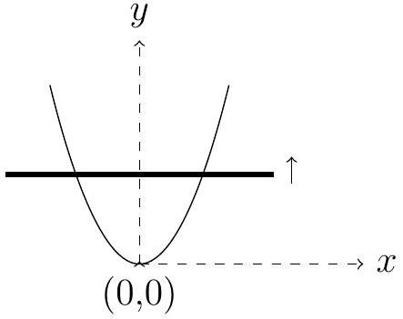

1. A uniform metallic wire is bent in the form of a parabola and is placed on a horizontal nonconducting floor. A vertical uniform magnetic induction $B$ exists in the region containing the parabolic wire. A straight conducting rod (shown by thick line in the figure below), starting from rest at the vertex of the parabola at time $t=0$, slides along the parabolic wire with its length perpendicular to the axis of symmetry of the parabola as shown in the figure. Take the equation of the parabola to be $y=k x^{2}$ where $k$ is a constant. Consider that rod always touches wire.

If the rod moves with a constant speed $v$,

(a) obtain an expression for the induced emf $\left(\epsilon_{1}\right)$ in terms of time $t$. [2]
□
(b) Assuming that the rod has resistance $\lambda$ per unit length, obtain current $\left(I_{1}\right)$ in the rod as a function of time. Assume that the parabolic wire has no resistance.
□
(c) Obtain the power needed to keep the rod moving with constant speed $v$.
□
