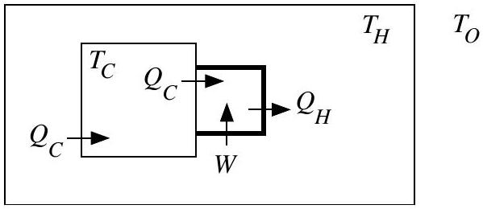

4. It is well known that the temperature of a closed room goes up if the refrigerator is switched on inside it. A refrigerator compartment set to temperature $T_{C}$ is turned on inside a hut in Leh (Ladakh). The atmosphere (outside the hut) can be considered to be a vast reservoir at constant temperature $T_{O}$. Walls of hut and refrigerator compartment are conducting. The temperature of the refrigerator compartment is maintained at $T_{C}$ with the help of a compressor engine. We explain the working of the refrigerator engine and the heat flow with the help of the associated figure.

The larger square is the refrigerator compartment with heat leak per unit time $Q_{C}$ into it from the room. The same heat per unit time $Q_{C}$ is pumped out of it by the engine (also called compressor and indicated by the smaller square in thick). The compressor does work $W$ and rejects heat per unit time $Q_{H}$ into the hut. The thermal conductance (in units of watt per kelvin) of the walls of the compartment and hut respectively are $K_{C}$ and $K_{H}$. After a long time it is found that temperature of the hut is $T_{H}$. The compressor works as a reverse Carnot engine and it does not participate in heat conduction process. [Marks:

(a) State the law of heat conduction for the walls of the hut and the refrigerator compartment.
□

(b) We define the dimensionless quantities $k=K_{H} / K_{C}, h=T_{H} / T_{O}$ and $c=T_{C} / T_{O}$. Express $h$ is terms of $c$ and $k$.

(c) Calculate stable temperature $T_{H}$ given $T_{O}=280.0 \mathrm{~K}, T_{C}=252.0 \mathrm{~K}$ and $k=0.90$.
□
(d) Now another identical refrigerator is put inside the hut. $T_{C}$ and $T_{O}$ do not change but $T_{H}$, the hut temperature will change to $T_{H}^{\prime}$. State laws of heat conduction for hut and one of the two identical refrigerator compartments.
□
(e) Assume that the dimensionless quantities $k$ and $c$ do not change. Let $h^{\prime}=T_{H}^{\prime} / T_{O}$. Obtain an expression for $h^{\prime}$.
□
