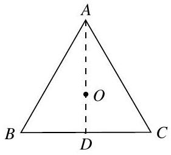
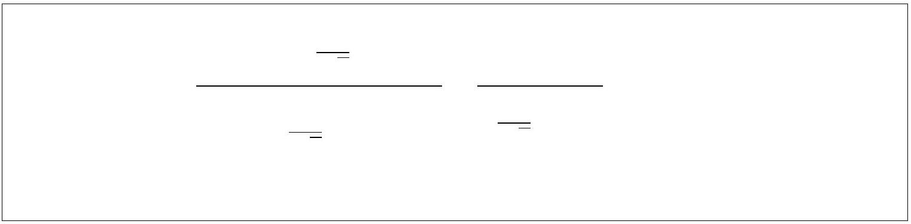
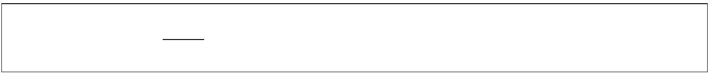
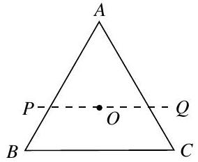
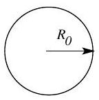
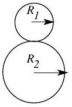
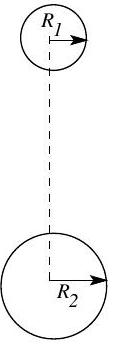

6. Consider an equilateral triangle ABC of side $2 a$ in the plane of the paper as shown. The centroid of the triangle is $O$. Equal charges $(Q)$ are fixed at the vertices $A, B$ and $C$. In what follows consider all motion and situations to be confined to the plane of the paper.
[Marks: 11]

    (a) A test charge $(q)$, of same sign as $Q$, is placed on the median AD at a point at a distance $\delta$ below $O$. Obtain the force $(\vec{F})$ felt by the test charge.

    (b) Assuming $\delta \ll a$ discuss the motion of the test charge when it is released.

    (c) Obtain the force ( $\vec{F}_{D}$ ) on this test charge if it is placed at the point $D$ as shown in the figure.

    (d) In the figure below mark the approximate locations of the equilibrium point(s) for this system. Justify your answer.

(e) Is the equilibrium at $O$ stable or unstable if we displace the test charge in the direction of $O P$ ? The line $P Q$ is parallel to the base $B C$. Justify your answer.

    (f) Consider a rectangle $A B C D$. Equal charges are fixed at the vertices $A, B, C$, and $D . O$ is the centroid. In the figure below mark the approximate locations of all the neutral points of the system for a test charge with same sign as the charges on the vertices. Dotted lines are drawn for the reference.
    (g) How many neutral points are possible for a system in which $N$ charges are placed at the $N$ vertices of a regular $N$ sided polygon?
    7. Bohr-Wheeler fission limit: Using the liquid drop model for the nucleus, Bohr and Wheeler established in 1939 a natural limit for $Z^{2} / A$ beyond which nuclei are unstable against spontaneous fission, where $Z$ and $A$ are the atomic and nucleon numbers respectively. In the following problem we will estimate this limit.
Consider the liquid drop model of a nucleus where the total energy of the nucleus is considered to be sum of surface energy $U_{A}$ and electrostatic energy $U_{E} . U_{A}$ can be expressed as $U_{A}=a_{S} R^{2}$ where $a_{S}$ is a dimensioned proportionality constant and $R$ is the radius of the nucleus. In what follows we take the nucleus to be spherical with its radius $R=r_{0} A^{1 / 3}$ where $r_{0}=1.2 \mathrm{fm}\left(1 \mathrm{fm}=10^{-15} \mathrm{~m}\right)$. Consider the case of a nucleus of radius $R_{0}$, atomic mass $A$ and atomic number $Z$ undergoing a fission reaction and breaking into two daughter nuclei of radii $R_{1}$ and $R_{2}$ as shown in figure below. We define the mass ratio of fission

products 1 to 2 as $f$. Assume that mass density and charge density of parent and daughter nuclei are same.
[Marks: 13]

(a) Original nucleus

(b) Moment of fission

(c) Large separation

(a) Estimate the nuclear mass density $\left(\rho_{n}\right)$ assuming $m_{p}=m_{n}$.
(a) Estimate the nuclear mass density $\left(\rho_{n}\right)$ assuming $m_{p}=m_{n}$.
(a) Estimate the nuclear mass density $\left(\rho_{n}\right)$ assuming $m_{p}=m_{n}$.
(a) Estimate the nuclear mass density $\left(\rho_{n}\right)$ assuming $m_{p}=m_{n}$.
(a) Estimate the nuclear mass density $\left(\rho_{n}\right)$ assuming $m_{p}=m_{n}$.
(a) Estimate the nuclear mass density $\left(\rho_{n}\right)$ assuming $m_{p}=m_{n}$.

a in terms of $f$. [1]
$U_{A}^{\mathrm{d}}=a_{S} R_{0}^{2} \alpha$. Obtain $\alpha$ in terms of $f$.
$U_{A}^{\mathrm{d}}=a_{S} R_{0}^{2} \alpha$. Obtain $\alpha$ in terms of $f$.
$U_{A}^{\mathrm{d}}=a_{S} R_{0}^{2} \alpha$. Obtain $\alpha$ in terms of $f$.
$U_{A}^{\mathrm{d}}=a_{S} R_{0}^{2} \alpha$. Obtain $\alpha$ in terms of $f$.
$U_{A}^{\mathrm{d}}=a_{S} R_{0}^{2} \alpha$. Obtain $\alpha$ in terms of $f$.
$U_{A}^{\mathrm{d}}=a_{S} R_{0}^{2} \alpha$. Obtain $\alpha$ in terms of $f$.
$U_{A}^{\mathrm{d}}=a_{S} R_{0}^{2} \alpha$. Obtain $\alpha$ in terms of $f$.

C (c) Obtain the total electrostatic energy $U_{E}^{\mathrm{p}}$ of parent nuclei in terms of given parameters
(c) Obtain the total electrostatic energy $U_{E}^{\mathrm{p}}$ of parent nuclei in terms of given parameters
(c) Obtain the total electrostatic energy $U_{E}^{\mathrm{p}}$ of parent nuclei in terms of given parameters
(c) Obtain the total electrostatic energy $U_{E}^{\mathrm{p}}$ of parent nuclei in terms of given parameters
(c) Obtain the total electrostatic energy $U_{E}^{\mathrm{p}}$ of parent nuclei in terms of given parameters
(c) Obtain the total electrostatic energy $U_{E}^{\mathrm{p}}$ of parent nuclei in terms of given parameters
[1] and relevant universal constants.
(d) Calculate $U_{E}^{\mathrm{p}}$ (in MeV) in terms of $Z$ and $A$ only.
(d) Calculate $U_{E}^{\mathrm{p}}$ (in MeV) in terms of $Z$ and $A$ only.
(d) Calculate $U_{E}^{\mathrm{p}}$ (in MeV) in terms of $Z$ and $A$ only.
(d) Calculate $U_{E}^{\mathrm{p}}$ (in MeV) in terms of $Z$ and $A$ only.
(d) Calculate $U_{E}^{\mathrm{p}}$ (in MeV) in terms of $Z$ and $A$ only.
[1]
[1]
[1]
[1]
[1]

∠ $\beta$ depends in

(e) i. Obtain the total electrostatic energy $U_{E}^{\mathrm{d}}$ of daughter nuclei just after the fission
(e) i. Obtain the total electrostatic energy $U_{E}^{\mathrm{d}}$ of daughter nuclei just after the fission i.e. at the instance shown in Fig. (b). i.e. at the instance shown in Fig. (b).

(f) Surface energy calculation
    i. Energy $Q$ released in fission is described as the difference in energy between the instances shown in Fig. (a) and Fig. (c) i.e. parent nuclei and product nuclei separated by a very large distance. Obtain the expression for $a_{S}$ in terms of $\{Q(\mathrm{inMeV}), Z, A, \alpha, \gamma\}$, where $A$ and $Z$ refer to the parent nucleus. Here $\gamma$ depends solely on $f$.
        ii. Assuming that the above expression holds, calculate $a_{S}$ (in units of MeV/fm ${ }^{2}$ ) for the following reaction with $Q$ value 173.2 MeV:
$$
{ }_{0}^{1} n+{ }_{92}^{235} \mathrm{U} \rightarrow{ }_{56}^{141} \mathrm{Ba}+{ }_{36}^{92} \mathrm{Kr}+3\left({ }_{0}^{1} n\right)
$$
    Condition for fission to occur can be expressed as $\frac{Z^{2}}{A}>C$ where $C$ depends on $a_{S}$ and $f$. Obtain $C$.
    (h) Assume that $a_{S}$ is a constant function of $f$, using the value of $a_{S}$ obtained in part f(ii), calculate the minimum value of $C$.
        (g) General $Z^{2} / A$ limit $\left[1 \frac{1}{2}\right]$
    8. A conducting wire frame of single turn in the shape of a rectangle $A B C D$ (sides $A B=a$, $B C=b)$ is free to rotate about the side $A B$ which is horizontal. Initially, the frame is held in a horizontal plane and a steady current $i$ (clockwise as seen from above) is switched on in the wire and then the frame is released (still free to rotate about $A B$ ). Find the magnitude and direction of the minimum uniform magnetic field necessary to keep the frame horizontal. The origin of the coordinate system is at $A$ and $A B$ lies along the direction of the $+x$ axis. Take the mass of the wire per unit length as $\lambda$ and the acceleration due to gravitational field to be $g \hat{k}$. Here $\hat{k}$ is unit vector in $+z$ direction.

**** END OF THE QUESTION PAPER ****

HOMI BHABHA CENTRE FOR SCIENCE EDUCATION
Tata Institute of Fundamental Research
V. N. Purav Marg, Mankhurd, Mumbai, 400088
