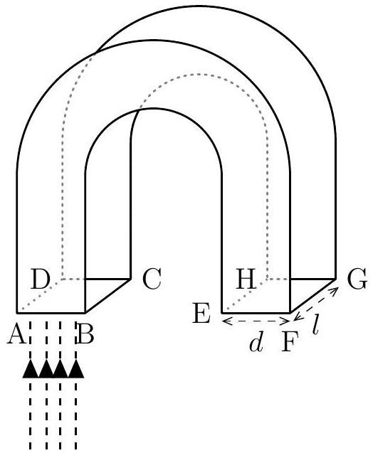
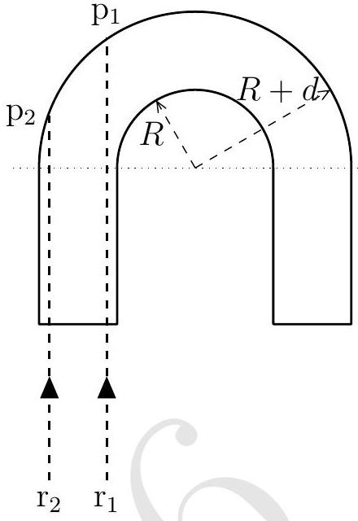
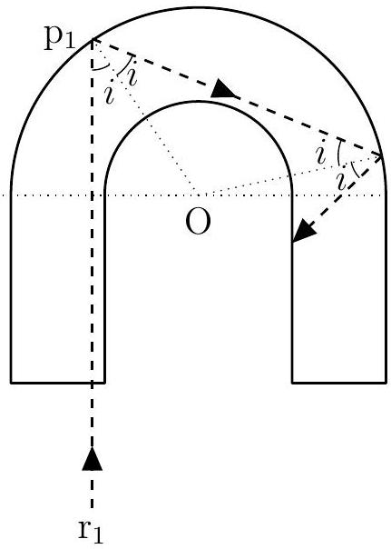
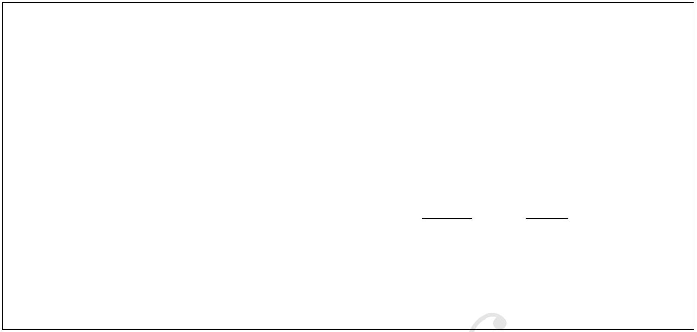
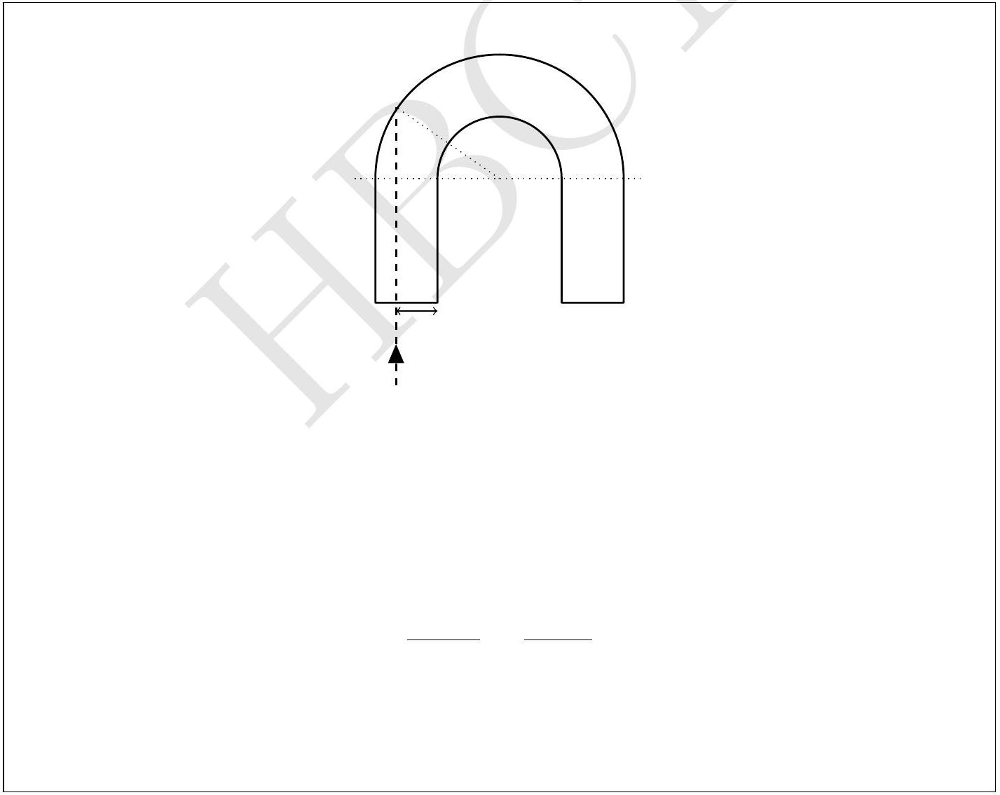

1. A glass rod of refractive index 1.50 of rectangular cross section $\{d \times l\}$ is bent into a "U" shape (see Fig. (A). The cross sectional view of this rod is shown in Fig. (B).

(A)

(B)

Bent portion of the rod is semi-circular with inner and outer radii $R$ and $R+d$ respectively. Parallel monochromatic beam of light is incident normally on face ABCD.

(a) Consider two monochromatic rays $\mathrm{r}_{1}$ and $\mathrm{r}_{2}$ in Fig. (B). State whether the following statements are True or False.

| Statement | True/False |
| :--- | :--- |
| If $\mathrm{r}_{1}$ is total internally reflected from the semi circular section at the point $\mathrm{p}_{1}$ then $\mathrm{r}_{2}$ will necessarily be total internally reflected at the point $\mathrm{p}_{2}$. | True |
| If $\mathrm{r}_{2}$ is total internally reflected from the semi circular section at the point $\mathrm{p}_{2}$ then $\mathrm{r}_{1}$ will necessarily be total internally reflected at the point $\mathrm{p}_{1}$. | False |

(b) Consider the ray $\mathrm{r}_{1}$ whose point of incidence is very close to the edge BC. Assume it undergoes total internal reflection at $\mathrm{p}_{1}$. In cross sectional view below, draw the trajectory of this reflected ray beyond the next glass-air boundary that it encounters.

(c) Obtain the minimum value of the ratio $R / d$ for which any light ray entering the glass normally through the face ABCD undergoes at least one total internal reflection.

(d) A glass rod with the above computed minimum ratio of $R / d$, is fully immersed in water of refractive index 1.33. What fraction of light flux entering the glass through the plane surface ABCD undergoes at least one total internal reflection?

