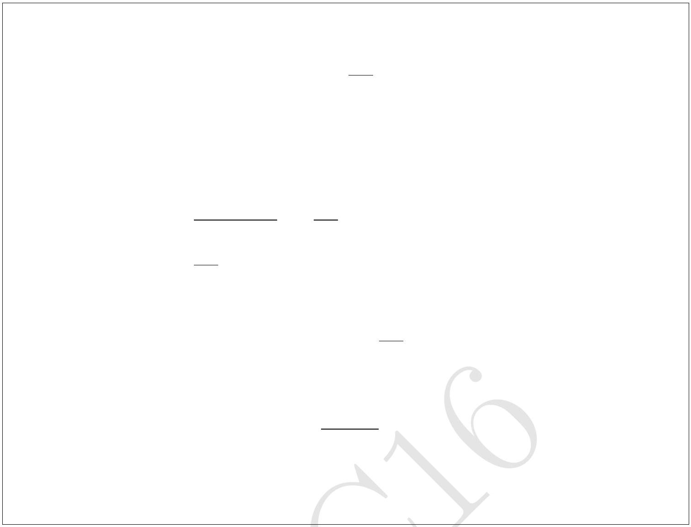

2. A uniformly charged thin spherical shell of total charge $Q$ and radius $R$ is centred at the origin. There is a tiny circular hole in the shell of radius $r(r \ll R)$ at $z=R$. Find the electric field just outside and inside the hole, i.e., at $z=R+\delta$ and $z=R-\delta$ $(\delta \ll r)$.

