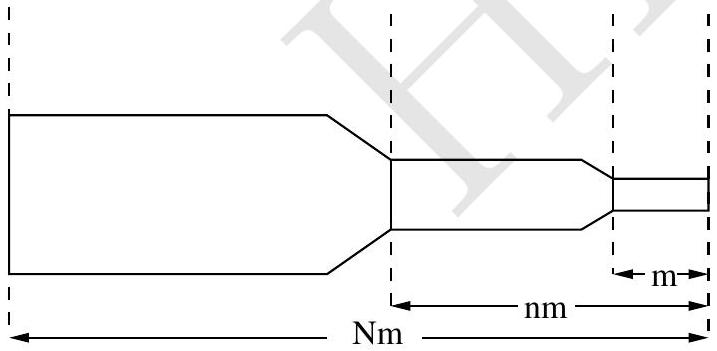
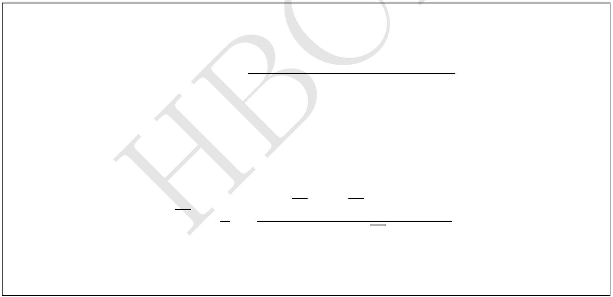

3. This problem is designed to illustrate the advantage that can be obtained by the use of multiple-staged instead of single-staged rockets as launching vehicles. Suppose that the payload (e.g., a space capsule) has mass $m$ and is mounted on a two-stage rocket (see figure). The total mass (both rockets fully fuelled, plus the payload) is $N m$.

    The mass of the second-stage rocket plus the
The mass of the second-stage rocket plus the payload, after first-stage burnout and separation, is $n m$. In each stage the ratio of container mass to initial mass (container plus fuel) is $r$, and the exhaust speed is $V$, constant relative to the engine. Note that at the end of each state when the fuel is completely exhausted, the container drops off immediately without affecting the velocity of rocket. Ignore gravity.

    (a) Obtain the velocity $v$ of the rocket gained from the first-stage burn, starting from rest in terms of $\{V, N, n, r\}$.

(b) Obtain a corresponding expression for the additional velocity $u$ gained from the second stage burn.

(c) Adding $v$ and $u$, you have the payload velocity $w$ in terms of $N, n$, and $r$. Taking $N$ and $r$ as constants, find the value of $n$ for which $w$ is a maximum. For this maximum condition obtain $u / v$.

(d) Find an expression for the payload velocity $w_{s}$ of a single-stage rocket with the same values of $N, r$, and $V$.

(e) Suppose that it is desired to obtain a payload velocity of 10 km/s, using rockets for which $V=2.5 \mathrm{~km} / \mathrm{s}$ and $r=0.1$. Using the maximum condition of part (c) obtain the value of $N$ if the job is to be done with a two-stage rocket.

