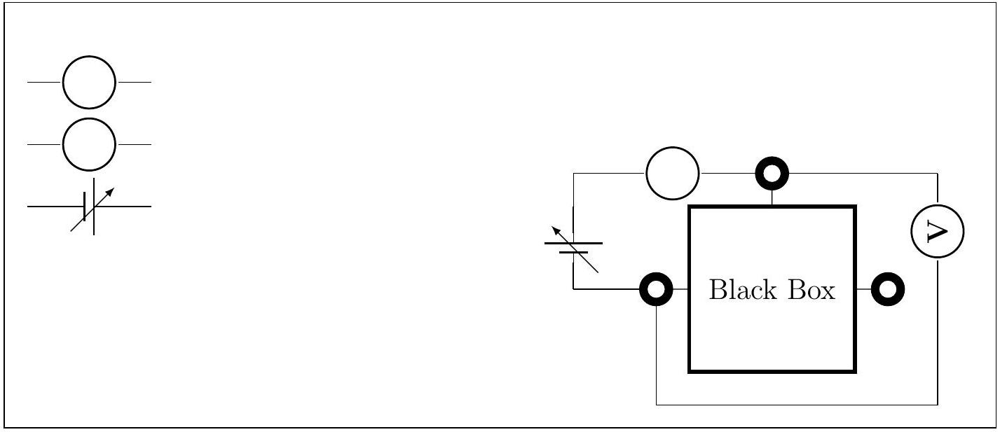
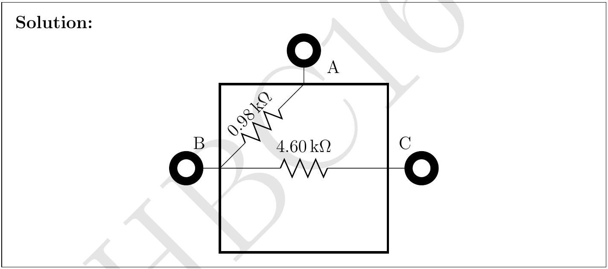
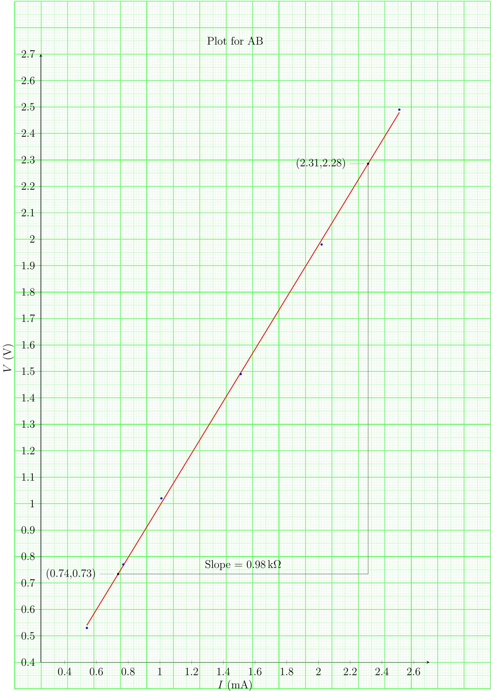
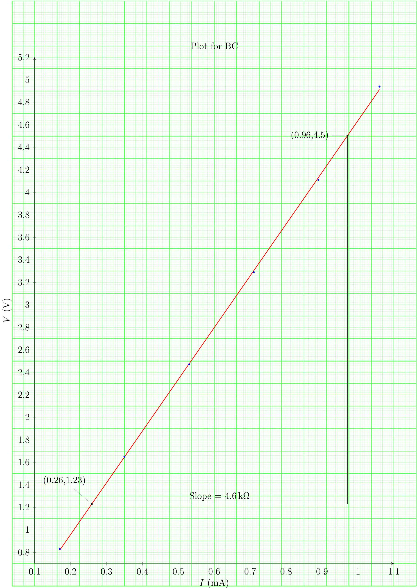
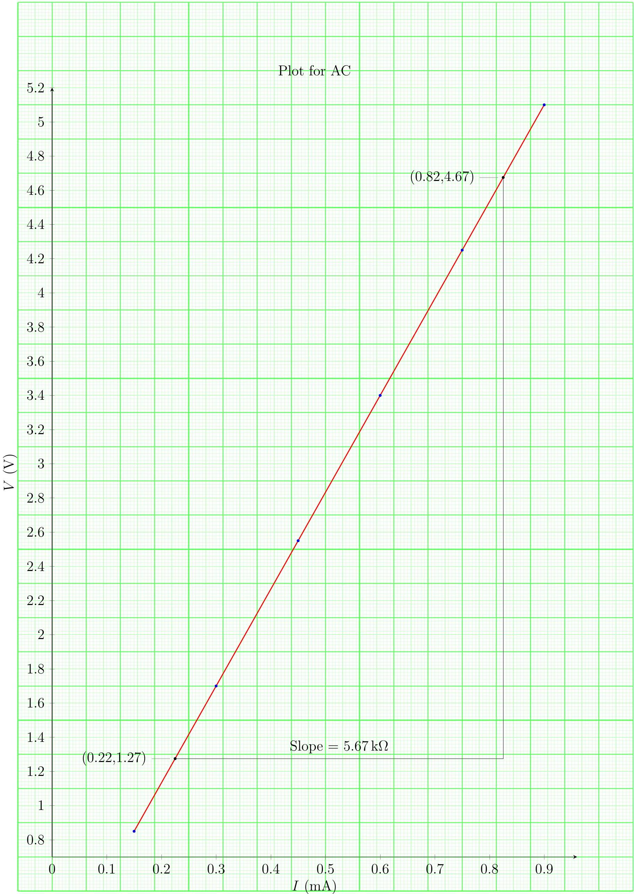

5. This question is about a closed electrical black box with three terminals $\mathrm{A}, \mathrm{B}$, and C as shown. It is known that the electrical elements connecting the points A, B, C inside the box are resistances (if any) in delta formation. A student is provided a variable power supply, an ammeter and a voltmeter. Schematic symbols for these elements are given in part (a). She is allowed to connect these elements externally between only two of the terminals (AB or BC or CA) at a time to form a suitable circuit.
    (a) Draw a suitable circuit using the above elements to measure voltage across the terminals A and B and the current drawn from power supply as per Ohm's law.

    (b) She obtains the following readings in volt and milliampere for the three possible connections to the black box.

| AB |  | BC |  | AC |  |
| :--- | :--- | :--- | :--- | :--- | :--- |
| $V(\mathrm{~V})$ | $I(\mathrm{~mA})$ | $V(\mathrm{~V})$ | $I(\mathrm{~mA})$ | $V(\mathrm{~V})$ | $I(\mathrm{~mA})$ |
| 0.53 | 0.54 | 0.83 | 0.17 | 0.85 | 0.15 |
| 0.77 | 0.77 | 1.65 | 0.35 | 1.70 | 0.30 |
| 1.02 | 1.01 | 2.47 | 0.53 | 2.55 | 0.45 |
| 1.49 | 1.51 | 3.29 | 0.71 | 3.4 | 0.60 |
| 1.98 | 2.02 | 4.11 | 0.89 | 4.25 | 0.75 |
| 2.49 | 2.51 | 4.94 | 1.06 | 5.10 | 0.90 |

In each case plot $V$ (on $Y$-axis)- $I$ (on $X$-axis) on the graph papers provided. Preferably use a pencil to plot. Calculate the values of resistances from the plots. Show your calculations below for each plot clearly indicating graph number.

(c) From your calculations above draw the arrangement of resistances inside the box indicating their values.

## INPhO - 2016 - Final Solutions

## INPhO - 2016 - Final Solutions

