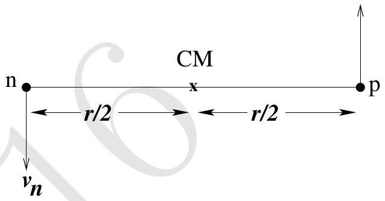

6. The Yukawa Potential and the nucleus

In 1935 the Japanese physicist Hideki Yukawa proposed that the strong attractive central potential binds the proton and the neutron with the associated potential energy $U(r)$ where

$$
U(r)=-g^{2} \frac{e^{-r / \lambda}}{r}
$$

where $\lambda=\hbar / m_{\pi} c$, with $m_{\pi}$, being the pion mass $=138.00 \mathrm{MeV} / \mathrm{c}^{2}$ and $r$ is the distance between nucleons. Here $g^{2}$ is the nuclear force constant. Our task is to determine the numerical value of nuclear force constant $g^{2}$. For simplicity we assume that the proton and the neutron in the deuteron have equal masses, $m_{\mathrm{p}}=m_{\mathrm{n}}=m=$ $938.00 \mathrm{MeV} / \mathrm{c}^{2}$. Here subscript n,p refers to neutron and proton respectively (see figure below). They are in circular motion under the influence of $U(r)$ about their centre of mass (CM) and their ground state binding energy $\left(E_{b}\right)$ is 2.22 MeV.

This two mass problem can be reduced to that of a single mass namely effective mass $\mu=m_{\mathrm{p}} / 2$ in CM frame with velocity $\bar{v}=$ $\overline{v_{\mathrm{n}}}-\overline{v_{\mathrm{p}}}$ where $\left|\overline{v_{\mathrm{n}}}\right|=\left|\overline{v_{\mathrm{p}}}\right|$. The total angular momentum of the n-p pair is quantized as per the Bohr quantization formula.

In what follows, express numerical values of energy in $\mathrm{MeV}\left(1 \mathrm{MeV}=1.6 \times 10^{-13} \mathrm{~J}\right)$ and length in $\mathrm{fm}\left(1 \mathrm{fm}=10^{-15} \mathrm{~m}\right)$, mass in $\mathrm{MeV} / \mathrm{c}^{2}$ and related quantities in terms of these.

(a) Calculate $\lambda$.
□
(b) State the total energy $E$ of the deuteron in terms of $\{\mu, r\}$ and relevant quantities.
□
(c) Relate the centripetal force on $\mu$ to $U(r)$.
□
(d) State the magnitude of the total angular momentum $L$ about the CM.

(e) Obtain the expression for $n^{\text {th }}$ energy level $\left(E_{n}\right)$ of deuteron in terms of $g^{2}$ and $r_{n}$, where $r_{n}$ is the radius of corresponding circular orbit.

(f) Consider the ground state of the deuteron $(n=1)$. Define $x_{1}=r_{1} / \lambda$. Here $r_{1}$ is the radius of first orbit of deuteron. Obtain a polynomial equation of $x_{1}$ involving only fundamental constants and $E_{b}$.

(g) Estimate $x_{1}$ numerically. Also calculate the radius of first orbit i.e. $r_{1}$. [2]
□

(h) Obtain the nuclear force constant $g^{2}$ numerically in units of MeV⋅fm.
□
**** END OF THE QUESTION PAPER ****
