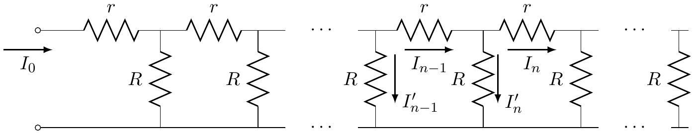

3. Consider an infinite ladder of resistors. The input current $I_{0}$ is indicated in the figure.

    (a) Find the equivalent resistance of the ladder. [2]
    Equivalent resistance =

(b) Find the recursion relation obeyed by the currents through the horizontal resistors $r$. You will get a relationship where $I_{n}$ will be related to (may be several) $I_{i} \mathrm{~s}, i<n, n>0$. Relation :
(c) Solve this for the special case $R=r$ to obtain $I_{n}$ and $I_{n}^{\prime}$ as explicit functions of $n$. You may have to make a reasonable assumption about the behaviour of $I_{n}$ as $n$ becomes large.
$$
I_{n}=
$$
$$
I_{n}^{\prime}=
$$
(d) If the ladder is chopped off after the $N$-th node (so that $I_{N+1}=0$ ) what will the form of $\frac{I_{n}}{I_{N}}$ be for $n \leq N$ ?
$$
\frac{I_{n}}{I_{N}}=
$$

Detailed answers can be found on page numbers:
