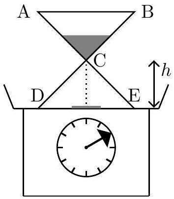
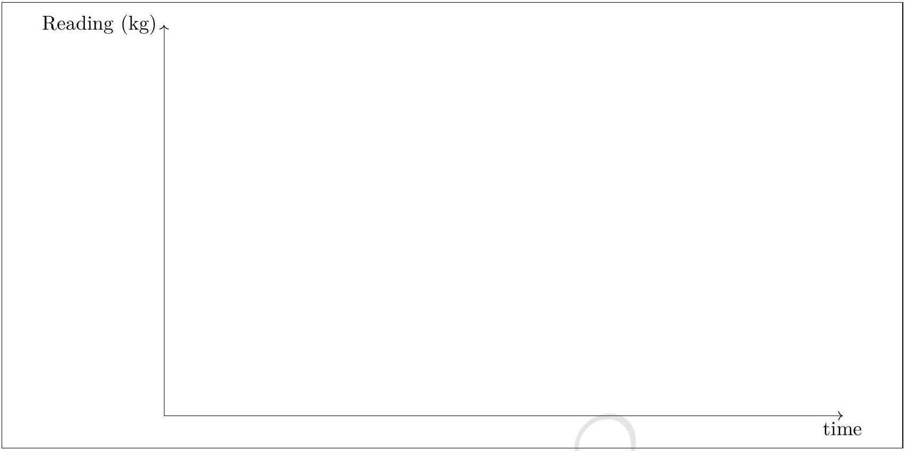

4. An hour glass is placed on a weighing scale. Initially all the sand of mass $m_{0} \mathrm{~kg}$ in the glass is held in the upper reservoir (ABC) and the mass of the glass alone is $M \mathrm{~kg}$. At $t=0$, the sand is released. It exits the upper reservoir at constant rate $\frac{d m}{d t}=\lambda \mathrm{kg} / \mathrm{s}$ where $m$ is the mass of the sand in the upper reservoir at time $t$ sec. Assume that the speed of the falling sand is zero at the neck of the glass and after it falls through a constant height $h$ it instantaneously comes to rest on the floor (DE) of the hour

glass. Obtain the reading on the scale for all times $t>0$. Make a detailed plot of the reading vs time.
Reading on the scale :

Detailed answers can be found on page numbers:
